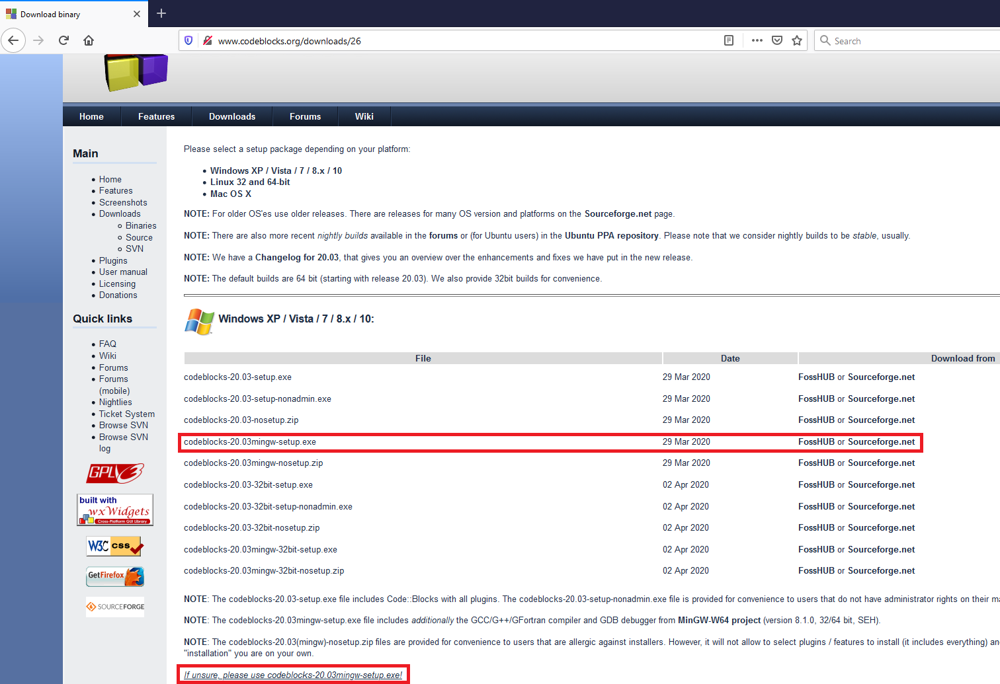
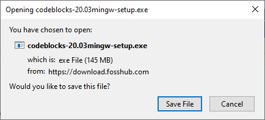
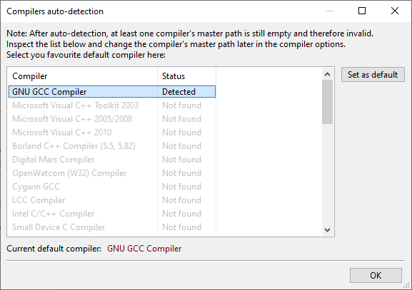
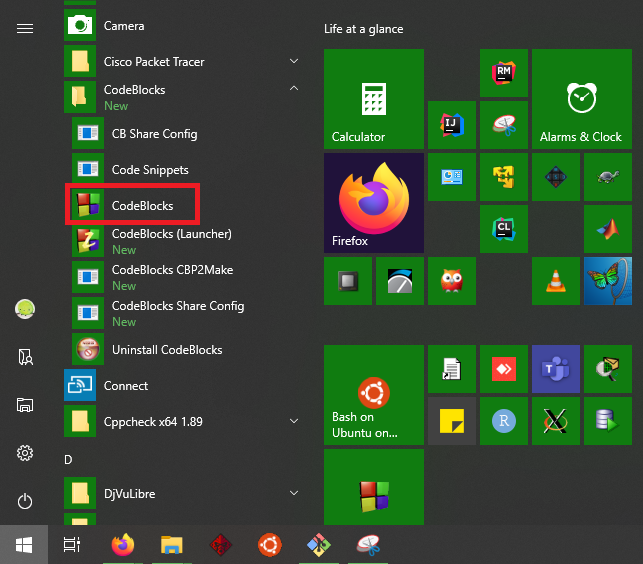
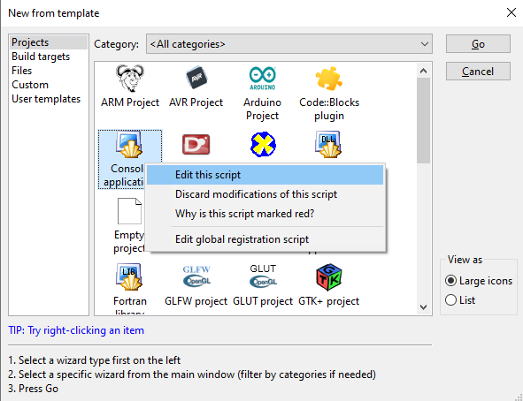
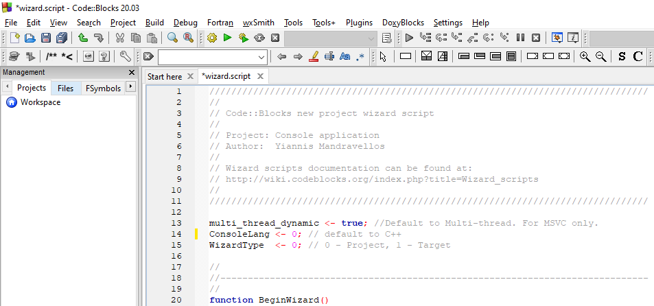
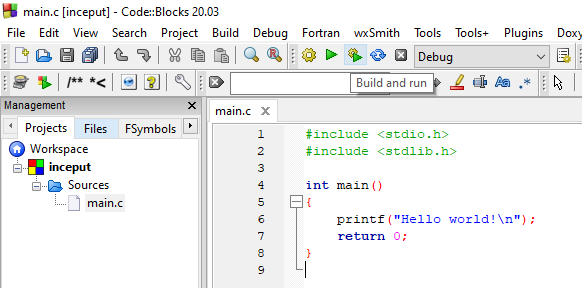

# Laboratorul 1

### ⚠ **Puneți cât mai multe întrebări! Nu există întrebări greșite.**
#### Semnalați orice fel de greșeli găsiți!

# Cuprins
## [Pregătirea mediului de lucru](#pregătirea-mediului-de-lucru-1)
## [Câteva programe simple](#câteva-programe-simple-1)
## [Exerciții](#exerciții-1)
## [Întrebări, erori și orice nu a fost acoperit deja](#întrebări-erori-diverse)
## [Resurse recomandate](#resurse-recomandate-1)

## Pregătirea mediului de lucru

Avem nevoie de un compilator pentru limbajul C și un editor de text. Puteți sări peste acest pas dacă aveți instalat Code::Blocks și vă funcționează un program de test și debugger-ul.

Pentru a simplifica procesul de instalare, este recomandat să folosiți [Code::Blocks](http://www.codeblocks.org/downloads/26).

Întrucât majoritatea dintre voi cel mai probabil aveți Windows, veți descărca executabilul `codeblocks-20.03mingw-setup.exe`, deoarece acesta include atât editorul de text, cât și compilatorul.

Aveți câteva indicații în imaginile de mai jos; dați click pe imagini pentru a le vedea la rezoluție mai mare.

Dacă nu aveți drepturi de admin, descărcați `codeblocks-20.03mingw-nosetup.zip`. Creați un folder nou, apoi extrageți arhiva în acel folder.

❕ *Dacă v-ați blocat sau aveți erori sau nu vă iese ceva, întrebați!*





Dacă folosiți Google Chrome, download-ul va apărea în bara de jos. La Firefox, e în dreapta sus:


Ideal ar fi să selectați o instalare completă. Dacă nu aveți suficient spațiu pe calculator, găsim soluții alternative.


Dacă ați instalat Code::Blocks mai demult, probabil aveți versiunea pe 32 de biți. Puteți să lăsați și versiunea veche sau puteți să o dezinstalați.

Desigur, puteți să folosiți ce aveți deja, nu sunt diferențe de interes pentru acest laborator între versiunile de Code::Blocks.

---

🚧 De adăugat: Pas instalare compilator.

Dacă aveți deja instalat Code::Blocks de mai demult, verificați doar că funcționează ce aveți. Dacă întâmpinați probleme, **întrebați!**

Urmând pașii de mai sus, compilatorul ar trebui să vină cu Code::Blocks. Dacă este nevoie să instalați compilatorul separat, recomandarea este să folosiți [MinGW-w64](https://sourceforge.net/projects/mingw-w64/). Începând cu versiunea 20.03, Code::Blocks include MinGW-w64. Versiunile mai vechi includeau o variantă învechită de MinGW.

---

După ce s-a terminat de instalat, va trebui să alegeți compilatorul: dați click pe `GNU GCC Compiler` și faceți click pe `Set as default`, apoi `OK`:



Când lansați Code::Blocks, folosiți fie shortcut-ul de pe Desktop, fie din meniu (mie, cel puțin, nu mi-a mers acel `CodeBlocks (Launcher)`):



Dați click pe `Create a new project`. Pasul următor este opțional, dar vă va scuti de un click pe viitor 😀

---

💡 Pas opțional:

> Click dreapta pe `Console application`, apoi `Edit this script`:



La linia 14, modificăm `ConsoleLang <- 1` (pentru C++) în `ConsoleLang <- 0` (pentru C):



Apoi salvăm apăsând `Ctrl`+`S` și închidem (click pe `x` din dreptul `wizard.script` sau `Ctrl`+`W`). Când am salvat, indicatorul galben din dreptul liniei modificate ar trebui să devină verde.

Acesta a fost pasul opțional.

---

Revenind la ce făceam înainte, creăm un nou proiect, dublu click pe `Console application` (sau click și apoi `Enter` sau `Go`). Pasul opțional va selecta automat limbajul C. Altfel, trebuie să selectați voi C în loc de C++ de fiecare dată când faceți un nou proiect.

❔ De ce? Pentru că vrem să fie folosit compilatorul de C și nu cel de C++.


După ce terminați de creat proiectul, ar trebui să obțineți ceva asemănător cu ce vedeți mai jos.

Apăsăm acum pe butonul cu o rotiță și un buton verde de play sau tasta `F9` (sau `Meniu`->`Build`->`Build and run`) (⚙ compilează programul - adică transformă codul sursă de mai jos în cod mașină (0 și 1), ▶ execută programul compilat):



Și ar trebui să obținem:


Acesta a fost primul pas din laboratorul 1. Felicitări! ✔

## Câteva programe simple
[Înapoi la cuprins](#cuprins)
### [Cel mai simplu program](#cel-mai-simplu-program-1)
### [Afișare](#afișare-1)
### [Variabile și constante](#variabile-și-constante-1)
### [Citire](#citire-1)
### [Instrucțiuni decizionale](#instrucțiuni-decizionale-1)

Continuăm proiectul de mai sus. Dacă ați sărit pasul anterior, creați un proiect de C (**nu** C++). Ar trebui să aveți acest cod:

```c
#include <stdio.h>
#include <stdlib.h>

int main()
{
    printf("Hello world!\n");
    return 0;
}
```

Î: Este programul de mai sus cel mai simplu program în C?

R: **Nu.**

### Cel mai simplu program

Î: Dar acesta de mai jos?

R: În varianta de C89/C90, da. Începând cu standardul C99, instrucțiunea `return 0` poate fi omisă **din funcția main**, iar comportamentul programului va fi la fel cu a avea `return 0` la sfârșit dacă execuția ajunge la sfârșitul funcției `main` (adică e de treabă compilatorul și pune `return 0` pentru noi). Puteți citi mai multe despre asta [aici](https://stackoverflow.com/a/207992).
```c
int main()
{
    return 0;
}
```
Ce face acest program? Întoarce valoarea `0`, ceea ce semnifică faptul că programul s-a încheiat cu succes. În loc de `0` poate fi folosit și macro-ul `EXIT_SUCCESS`, dar acesta este definit în header-ul `<stdlib.h>`.

De ce este important acest lucru? Deoarece programul poate la fel de bine să nu funcționeze, iar în acea situație am dori să știm că nu s-a încheiat cu succes.

Înlocuind mai sus `0` cu `1` și rulând programul, după ce închidem fereastra cu programul vedem în partea de jos că textul cu valoarea returnată este colorat cu roșu.

Ideal, am vrea să știm și din ce motiv programul a crăpat, iar astfel putem întoarce diverse valori nenule, unde fiecare număr corespunde unui tip de eroare. Veți afla mai multe despre acest subiect (și nu numai) la cursurile de sisteme de operare: [USO](https://cs.unibuc.ro/~pirofti/uso.html) (semestrul viitor) și SO (anul III).

Ce mai putem învăța din programul de mai sus?

1. [Tipuri de date](#tipuri-de-date)
2. [Sintaxa pentru subprograme](#subprograme)

Să le luăm pe rând.

#### Tipuri de date

Tipurile de date înseamnă, foarte pe scurt, *sensul* pe care îl dăm unor date. De exemplu, `20` poate fi considerat fie un număr, fie alăturarea simbolurilor (caracterelor) `2` și `0`.

Atunci când scriem mesaje, ne interesează ca `2` și `0` să fie entități distincte pentru a le modifica ușor în mod independent. Pe de altă parte, dacă vrem să facem calcule, ne dorim ca aceste calcule să fie efectuate cât mai eficient, ceea ce înseamnă că trebuie să ne exprimăm această intenție prin specificarea unui tip de date adecvat.

Din punctul de vedere al calculatorului, în limbajul C tipurile de date sunt o proprietate a obiectelor, funcțiilor și expresiilor, care determină modul de reprezentare a valorii obiectului/funcției/expresiei respective.

Tipurile de date ajută compilatorul să realizeze diverse verificări asupra corectitudinii programului (de exemplu, poate nu vrei să aduni mere cu pere), iar ulterior să facă și unele optimizări.

🔎 Prin obiecte mă refer la variabile declarate, variabile temporare sau literali (constante); riguros vorbind, [lucrurile sunt mai complicate](https://en.cppreference.com/w/c/language/object), dar momentan este suficient atât.

Din punctul de vedere al persoanei care scrie/citește codul sursă, tipurile de date ajută la documentarea codului respectiv.

În limbajul C, tipurile de date pot fi împărțite în:
- tipuri numerice:
  - `int` (numere întregi): `-1`, `50`
  - `float`, `double` (numere reale): `2.7`, `1.5e10` (notație științifică: echivalent cu `1.5*1.5*...1.5*5` de 10 ori)
- caractere, declarate cu `char`: `a`, `Z`, `&`
- enumerări, declarate cu `enum`: de exemplu `enum Culoare {ROSU, GALBEN, VERDE};`
- tipul `void` (nimic (sau orice), vedem mai încolo)
- derivate:
  - tablouri (vectori) - pentru colecții de elemente de același tip: `int loto[] = {1, 2, 3};`
  - pointeri - rețin adrese de memorie: de exemplu, o variabilă de tip `int*` reține adresa unei variabile de tip `int`
  - structuri - pentru grupări de elemente de tipuri (eventual) diferite:
    - `struct persoana { int anul_nasterii; float inaltime; };`
  - uniuni - momentan doar să știți că există

Am dat doar câteva exemple ca să vă faceți o idee, lista de mai sus nu este exhaustivă. Putem face și alte clasificări după alte criterii.

Citiți mai multe în fișierul PDF asociat laboratorului sau [aici](https://en.cppreference.com/w/c/language/type).

#### Subprograme

Denumite și funcții/proceduri/subrutine. În limbajul C, denumirile sunt echivalente.

Așadar, din definiția funcției `main`, ce putem deduce?
- avem un tip de date pentru valoarea pe care o întoarce funcția; acest tip este `int`
- avem un nume: acesta este `main`
- avem o listă de parametri/argumente: aceasta este reprezentată prin `()`, iar în acest caz nu avem argumente
  - totuși, funcția `main` poate avea argumente, iar atunci în loc de `int main()` avem `int main(int argc, char **argv)`
  - prin urmare, argumentele reprezintă niște variabile (aceste argumente se numesc parametri formali)
  - riguros, ar trebui să scriem `int main(void)` pentru a arăta în mod explicit că funcția nu are argumente
- avem zero sau mai multe instrucțiuni între acolade
  - întrucât la început am specificat un tip de date de retur, trebuie să întoarcem o valoare (riguros ar fi expresie), folosind instrucțiunea `return`
  - pentru funcțiile care întorc `void`, nu întoarcem valori (avem cel mult `return;` fără altceva)

Putem deduce că structura generală a unei funcții este asemănătoare cu
```c
<tip-retur> <nume-functie> (<tip-p1> <nume-p1>, ..., <tip-pn> <nume-pn>)
{
    <instructiune-1>
    ...
    <instructiune-n>
    return <expresie de tip tip-retur>; /* sau return; daca tip-retur este void */
}
```

Exemplu: adunarea (naivă) a două numere
```c
int adunare(int numar1, int numar2)
{
    return numar1 + numar2;
}
```

Î: Totuși, de ce să folosim alte funcții? Nu e suficient `main`?

R: Pentru programe simple, e suficient `main`. Totuși, este bine să vă obișnuiți să folosiți funcții cât mai repede, întrucât vă învață să lucrați organizat.

Î: De ce este adunarea "naivă"?

R: Pentru că nu tratează corect cazurile speciale de overflow/underflow. Este un detaliu de care e bine să ținem cont, chiar dacă în majoritatea cazurilor nu vom verifica explicit acest lucru, deoarece ar fi ineficient.

Î: Ce înseamnă acel `/* bla bla */`?
```c
/* Acesta este un comentariu de tip bloc si se poate intinde pe mai multe randuri

Comentariile sunt ignorate de compilator, dar ne ajuta sa intelegem ce face codul
si sa ii ajutam si pe altii sa inteleaga ce am vrut noi sa obtinem cu acest cod*/
// Incepand cu C99, exista si comentarii la nivel de rand
```
Comentariile bloc încep cu `/*` și se încheie cu `*/`, iar cele la nivel de linie încep cu `//` și "expiră" la sfârșitul rândului.

### Afișare
[Înapoi la programe](#câteva-programe-simple-1)

Operațiile de intrare/ieșire (input/output) sunt posibile prin intermediul bibliotecii standard `<stdio.h>`. De la ce vine stdio?
  - std = standard
  - io = input/output
  - h = header

În `<stdio.h>` avem mai multe funcții predefinite pentru citire și afișare. Momentan, ne limităm la citirea de la tastatură și afișarea pe ecran. Funcțiile care ne interesează acum sunt:
  - [`printf(const char *format, ...)`](https://en.cppreference.com/w/c/io/fprintf)
    - cu parametrul `format` spunem în ce mod vrem să facem afișarea
    - cu parametrii `...` spunem ce vrem să afișăm; aceste "..." semnifică zero sau mai multe argumente
  - [`scanf(const char *format, ...)`](https://en.cppreference.com/w/c/io/fscanf), asemănător cu `printf`
    - cu `format` spunem ce fel de date citim
    - cu `...` spunem "locul" unde vrem să primim ceea ce citim

Citirea o detaliem un pic mai târziu, întrucât nu am discutat despre variabile.

În parametrul `format`, fiecare `%` este tratat în mod special. Acest `%` indică faptul că începe un **specificator de conversie**. Fiecărui specificator îi corespunde un *argument* în acei `...`. Excepție face `%%`, care va afișa `%`.

Câțiva specificatori de conversie mai comuni (am inclus și caracterul de început `%`):
- `%d`: număr întreg cu semn reprezentat în baza 10 (**d**ecimal integer)
- `%u`: număr întreg fără semn reprezentat în baza 10 (**u**nsigned integer)
- `%x`: număr întreg fără semn reprezentat în baza 16 (he**x**adecimal representation)
- `%o`: număr întreg fără semn reprezentat în baza 8 (**o**ctal representation)
- `%f`: număr real reprezentat în virgulă mobilă (**f**loating point)
- `%c`: **c**aracter
- `%s`: șir de caractere (**s**tring)

Utilizarea `#` între caracterul `%` și caracterul de conversie îi spune funcției `printf` că dorim "afișarea alternativă". Aceasta are efect numai pentru unii specificatori de conversie, acolo unde are sens. Verificați ce afișează programul de mai jos dacă scoateți acest `#`.

Caracterul `\n` este și el tratat special și înseamnă "rând nou" (altfel, afișarea s-ar face în continuare).
```c
#include <stdio.h>  /* pentru functia printf */

int main()
{
    printf("Aceasta este prima afisare\n");
    printf("Niste numere intregi: %d, %d si %d\n", 1, 2, 3);
    /* afiseaza "Niste numere intregi: 1, 2 si 3" */
    printf("Numarul 20 in baza 10: %u, in baza 16: %#x si in baza 8: %#o \n", 20, 20, 20);
    /* afiseaza "Numarul 20 in baza 10: 20, in baza 16: 0x14 si in baza 8: 024" */
    printf("Afisarea unui numar cu 3 spatii pentru aliniere la dreapta: %3d\n", 14);
    /* afiseaza "Afisarea unui numar cu 3 spatii pentru aliniere:  14" */
    return 0;
}
```

### Variabile și constante
[Înapoi la programe](#câteva-programe-simple-1)

Programele de mai sus nu au folosit deloc variabile:
- `"Hello world!\n"` este un șir de caractere constant (altfel spus, un literal de tip șir de caractere)
- `"Niste numere intregi: %d, %d si %d\n"` este un alt șir de caractere constant, nu e relevant în acest context faptul că are în componență specificatori de conversie
- `0`, `1`, `2`, `3` sunt literali de tip întreg cu semn
- useless fact: nu există literalul `0` în baza 10 în limbajul C; întrucât începe cu `0`, este considerat un literal în baza 8 ([sursa](https://stackoverflow.com/questions/26625311/is-0-an-octal-or-a-decimal-in-c))

Constantele sunt... constante, imutabile, nu își pot schimba valoarea. Cele de mai sus se numesc literali; sunt tot un fel de constante, dar nu au nume.

Constantele se declară astfel: `const tip_de_date nume_constanta = expresie;`. Exemple:
- `const int x = 3;`
- `const int y = x*x - 6;`

Pentru a scrie programe mai complicate, avem nevoie inevitabil de variabile; nu putem face foarte multe lucruri doar cu constante și literali.

Variabilele sunt caracterizate de 4 informații:
- tipul de date
- numele (cunoscut și ca [identificator](https://en.cppreference.com/w/c/language/identifier))
- valoarea reținută, **dacă variabila este inițializată; atenție! folosirea valorii unei variabile neinițializate înseamnă bug-uri**
- adresa de memorie

Variabilele se declară folosind sintaxa `tip_de_date nume_variabila;`. Desigur, dacă avem nevoie, putem inițializa variabilele atunci când le declarăm: `tip_de_date nume = expresie;`.

De exemplu, `int nr;` declară o variabilă întreg cu numele `nr`, iar `int* adr` declară o variabilă de tip `int*` cu numele `adr`.

```c
#include <stdio.h>

int main()
{
    int nr;
    int* adr;
    nr = 15;
    printf("Variabila `nr` are valoarea %d si adresa %p.\n", nr, (void*)&nr);
    /* afiseaza "Variabila `nr` are valoarea 15 si adresa 0x7ffde5e842ec." */

    nr = 25;  // putem schimba valoarea retinuta de o variabila
    adr = &nr;
    printf("Variabila `nr` are valoarea %d si adresa %p.\n", nr, (void*)adr);
    /* afiseaza "Variabila `nr` are valoarea 25 si adresa 0x7ffde5e842ec." */

    *adr = 35;  // asta se numeste dereferentiere si este operatia "inversa" celei de la linia 12: `adr = &nr;`
    printf("Variabila `nr` are valoarea %d si adresa %p.\n", nr, (void*)&nr);
    /* afiseaza "Variabila `nr` are valoarea 35 si adresa 0x7ffde5e842ec." */

    printf("Variabila `adr` are valoarea %p, adresa %p, iar prin dereferentiere obtinem %d.\n", (void*)adr, (void*)&adr, *adr);
    /* afiseaza "Variabila `adr` are valoarea 0x7ffde5e842ec, adresa 0x7ffde5e842f8, iar prin dereferentiere obtinem 35." */

    const int x = 3;
    // nu putem schimba valoarea retinuta de o constanta
    // x = 4;     // error: assignment of read-only variable 'x'

    // nu putem prelua adresa unei constante folosind o variabilă! tipul de date `const int` este diferit de tipul de date `int`
    // `adr` are tipul de date `int*`, deci retine adrese catre variabile de tip `int`, nu `const int`
    // pentru a retine adresa lui `x`, avem nevoie de un obiect de tip `const int*`
    // adr = &x;  // error: assignment discards 'const' qualifier from pointer target type

    nr = x;
    printf("Variabila `nr` are valoarea %d si adresa %p.\n", nr, (void*)&nr);
    /* afiseaza "Variabila `nr` are valoarea 3 si adresa 0x7ffde5e842ec." */

    printf("Variabila `x` are valoarea %d si adresa %p.\n", x, (void*)&x);
    /* afiseaza "Variabila `x` are valoarea 3 si adresa 0x7ffde5e842f4." */

    int const y = nr + 13, *adr_y;
    adr_y = &y;  // este ok, adr_y are tipul `const int*`
    printf("Variabila `y` are valoarea %d si adresa %p.\n", y, (void*)adr_y);
    /* afiseaza "Variabila `y` are valoarea 16 si adresa 0x7ffde5e842f0." */
    return 0;
}
```

#### Alte observații
- constantele se inițializează la declarare
- veți obține alte valori ale adreselor decât cele din comentarii, dar la primele 3 afișări veți avea o aceeași adresă
- `(void*)` este necesar dacă vrem să respectăm standardul C; mai multe detalii [aici](https://stackoverflow.com/questions/9053658), [aici](https://stackoverflow.com/a/15292265) și [aici](https://stackoverflow.com/a/2369593)
- `const tip_de_date` este echivalent cu `tip_de_date const`: important este să folosiți aceeași notație peste tot din simplul motiv că e mai ușor de înțeles codul; mai sus am folosit notații diferite *doar cu scop ilustrativ!* Detalii în [documentație](https://en.cppreference.com/w/c/language/declarations)
- în limbajul C, de obicei spațiile nu sunt foarte importante: `int* adr` este echivalent cu `int *adr` sau `int*adr`
- operatorul de atribuire este `=` deoarece atribuirea este o instrucțiune foarte frecventă, iar cei care au făcut limbajul au considerat că 2 caractere ar fi prea mult (în alte limbaje avem `:=` sau `<-`)
- exemplul este destul de stufos, puteți reveni ulterior, nu vă faceți griji dacă nu ați înțeles tot
- puneți întrebări

### Citire
[Înapoi la programe](#câteva-programe-simple-1)

Următorul pas este să efectuăm citirea datelor în variabile într-un mod interactiv.

După cum am menționat și la pasul de [afișare](#afișare-1), vom folosi funcția `scanf`, disponibilă în header-ul `<stdio.h>`.

Funcția `scanf` este asemănătoare cu `printf` de mai devreme:
- primul argument reprezintă un șir de caractere ce poate conține specificatori de conversie
  - există câteva diferențe, însă cea mai importantă este aceea că `%s` este complet **nesigur** dacă nu specificăm un număr maxim de caractere pe care vrem să le citim: dacă vrem să citim un șir de cel mult 15 caractere, vom folosi specificatorul de conversie `%15s`
- restul argumentelor trebuie să corespundă *adreselor* variabilelor în care vrem să reținem ce citim

```c
#include <stdio.h>

int main()
{
    int a, b, citite;
    char c;
    float f;
    citite = scanf("%d %d %c %f", &a, &b, &c, &f);
    printf("Am citit %d variabile: acestea sunt: %d, %d, %c si %f.\n", citite, a, b, c, f);
    return 0;
}
```

Observații:
- în aplicații mai importante, trebuie să verificăm **întotdeauna** dacă o operație a reușit sau nu
  - în acest caz, am verificat rezultatul întors de funcția `scanf`, prin care aflăm numărul de variabile pentru care s-a făcut atribuirea cu succes
    - câteva erori posibile: nu avem de unde să citim sau a intervenit o eroare în procesul de citire (de exemplu la conversii)
  - de asemenea, funcția `printf` întoarce numărul de caractere afișate
    - câteva erori posibile: nu avem unde să afișăm sau erori de conversie
- funcția `scanf` "consumă" toate [spațiile albe](https://en.cppreference.com/w/c/io/fscanf) (excepția care vă interesează este `%c`); detalii în [documentație](https://en.cppreference.com/w/c/io/fscanf)

### Instrucțiuni decizionale
[Înapoi la programe](#câteva-programe-simple-1)

Sau un mod pompos de a spune `dacă/altfel` (`if/else`).

Rulând programul de mai sus într-un mod în care eșuează citirea, putem obține rezultate de felul următor:
```
Am citit -1 variabile: acestea sunt: 32767, 0, � si 0.000000.
Am citit -1 variabile: acestea sunt: 32764, 0, ( si 0.000000.
Am citit -1 variabile: acestea sunt: 32765, 0, 
 si 0.000000.
Am citit -1 variabile: acestea sunt: 32766, 0, > si 0.000000.
Am citit -1 variabile: acestea sunt: 32765, 0, n si 0.000000.
Am citit -1 variabile: acestea sunt: 0, 0,  si 0.000000.
```

**Atenție!** În situația de mai sus, am afișat valorile unor variabile *neinițializate*, ceea ce constituie un program incorect.

Nu dorim să se întâmple acest lucru. De aceea (dar și din alte motive), avem nevoie în plus de instrucțiuni decizionale.

Un prim exemplu ar fi să modificăm programul de mai sus astfel încât să nu afișăm acele variabile dacă citirea nu a reușit:
```c
#include <stdio.h>

int main()
{
    int a, b, citite;
    char c;
    float f;
    citite = scanf("%d %d %c %f", &a, &b, &c, &f);
    if(citite != 4)
        printf("Eroare la citire!\n");
    else
        printf("Am citit %d variabile: acestea sunt: %d, %d, %c si %f.\n", citite, a, b, c, f);
    return 0;
}
```

Următorul exemplu prezintă și cazul în care avem mai mult de două ramuri:
```c
#include <stdio.h>

int hungry(int hour) {
    if((hour >  7 && hour < 10) ||  // breakfast
       (hour > 12 && hour < 15) ||  // lunch
       (hour > 18 && hour < 23))    // dinner
    {
        return 1;
    }
    return 0;
}

void eat() { printf("Eating!\n"); }
void drink() { printf("Drinking!\n"); }

int tired() {
    int amount;
    printf("How tired are you? (0 - not at all, 10 - zombie)\n");
    scanf("%d", &amount);
    return amount > 3;
}

void rest() { printf("Zzz...\n"); }

void have_fun();  // linia 25

int main()
{
    int h;
    printf("What time is it? (0-23)\n");
    scanf("%d", &h);
    if(hungry(h)) {
        eat();
        drink();
    }
    else if(tired())
        rest();
    else
        have_fun();
    return 0;
}

void have_fun() { /* implementation-defined */ }
```

Observații:
- parantezele nu sunt necesare, întrucât operatorul `&&` este mai prioritar decât operatorul `||`; totuși, nu e nevoie să rețineți precedența dacă folosiți paranteze pentru a arăta în ce ordine vreți să aibă loc evaluările operanzilor; detalii despre operatori [aici](https://en.cppreference.com/w/c/language/operator_precedence)
- la linia 25 am *declarat* funcția `have_fun`, însă nu am furnizat o definiție/implementare/corp; am furnizat definiția pe ultimul rând: chiar dacă în programul de mai sus funcția nu face nimic, aceea este o definiție validă
- putem simplifica funcția `hungry` astfel:
```c
int hungry() {
    // breakfast, lunch or dinner
    return (hour >  7 && hour < 10) || (hour > 12 && hour < 15) || (hour > 18 && hour < 23);
}
```

## Exerciții
[Înapoi la cuprins](#cuprins)

Veți găsi toate rezolvările în folder-ul `solutii`. Totuși, este bine să încercați să rezolvați exercițiile pe cont propriu.

Exerciții bazate pe acest laborator:
- modificări la programul al doilea de la `if/else`:
  - în funcția `hungry`, ar trebui ca ora să fie incrementată cu 1, iar modificarea să fie vizibilă și în funcția `main`
  - citiți în `main` un șir de caractere pe ramura cu `hungry`, iar apoi afișați acest șir cu `%s` în funcția `eat` sau în funcția `drink`
  - adăugați orice condiții care considerați că lipsesc

Exercițiile din PDF:
1. Se dă ecuația de gradul al II-lea: `a*x^2 + b*x + c = 0`. Să se calculeze rădăcinile ecuației folosind ori de câte ori se poate operatorii de atribuire combinați.
2. Se citesc trei numere întregi de la tastatură. Să se afișeze maximul dintre cele  3 numere folosind operatorul decizional.
3. Se citește un număr întreg n de la tastatură. Să se calculeze `n*8`, `n/4`  și  `n*10` folosind operatorii logici de deplasare la nivel de bit.
4. Se citește un număr întreg de la tastatură. Să se determine dacă acesta este par sau impar folosind doar operatorii logici la nivel de biți.

## Întrebări, erori, diverse
[Înapoi la cuprins](#cuprins)

* 🚧

## Resurse recomandate
- [cppreference.com](https://en.cppreference.com/w/c)
- [StackOverflow](https://stackoverflow.com/questions/tagged/c?tab=Votes)
- [C FAQ](http://c-faq.com/questions.html)

### Resurse de evitat
- cărțile lui Herbert Schildt (de ce? [pentru că](https://www.seebs.net/c/c_tcn4e.html) și [pentru că](http://www.lysator.liu.se/c/schildt.html) și... [pentru că](https://web.archive.org/web/20000816131043/http://www.qnx.com/~glen/deadbeef/2764.html))

