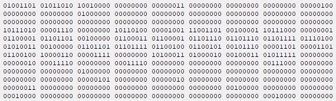

# Laboratorul 4

### ⚠ Puneți cât mai multe întrebări! Nu există întrebări greșite.
#### Semnalați orice fel de greșeli găsiți!

# Cuprins
## [Programe discutate](#programe-discutate-1)
## [Organizarea codului în fișiere separate](#organizarea-codului-în-fișiere-separate-1)
## [Exerciții](#exerciții-1)
## [Întrebări, erori și orice nu a fost acoperit deja](#întrebări-erori-diverse)
## [Resurse recomandate](#resurse-recomandate-1)

## Programe discutate
### [Structuri](#structuri-1)
### [`typedef`](#typedef-1)
### [Uniuni](#uniuni-1)
### [Câmpuri de biți](#câmpuri-de-biți-1)
### [Clase de memorare](#clase-de-memorare-1)
### [Alocare dinamică](#alocare-dinamică-1)

### Structuri

[Structurile](https://en.cppreference.com/w/c/language/struct) reprezintă o grupare de elemente (de tipuri de date eventual eterogene, adică diferite):
```c
struct Persoana
{
    char nume[30];
    unsigned int varsta;
};
```
Vom numi `nume` și `varsta` membrii sau câmpurile structurii `struct Persoana`.

Desigur, nu este obligatoriu ca tipurile de date ale câmpurilor să fie diferite:
```c
struct punct
{
    int x, y;
};
```
Definițiile de mai sus introduc tipurile de date `struct Persoana` și `struct punct`. Declararea variabilelor se poate face la momentul definirii structurii sau ulterior:
```c
#include <stdio.h>

struct Persoana
{
    char nume[30];
    unsigned int varsta;
};

int main()
{
    struct punct
    {
        int x, y;
    } p1, p2;
    printf("Introduceti coordonatele x si y separate printr-un spatiu: ");
    scanf("%d %d", &p1.x, &p1.y);
    p2 = p1;  // copierea se face bit cu bit

    struct Persoana pers;
    printf("Introduceti numele: ");
    fgets(pers.nume, 30, stdin);  // folosim fgets deoarece numele poate contine spatii
    pers[28] = '\0';  // eliminam '\n'
    printf("Introduceti varsta: ");
    scanf("%d", &pers.varsta);
    printf("%s in varsta de %u ani se afla in punctul (%d, %d).\n", pers.nume, pers.varsta, p2.x, p2.y);
    return 0;
}
```
Observații:
- declararea unui `struct punct` nu este posibilă decât în funcția `main`
- tipul `struct Persoana` poate fi folosit și în alte funcții pentru declararea parametrilor, a variabilelor și a tipurilor de întoarcere
- trebuie să aveți grijă la copierea structurilor dacă aveți câmpuri care sunt pointeri, deoarece se va copia valoarea pointerului
  - asta înseamnă că, dacă modificăm câmpul în una dintre variabile, modificarea va fi vizibilă și în cealaltă variabilă, ceea ce nu este de dorit de obicei
  - ar trebui copiate separat valorile spre care arată acel pointer
- la copierea unor variabile de tip `struct Persoana` nu vom avea probleme, deoarece membrul `nume` are alocat spațiul (este un vector)

Structurile pot fi [inițializate](https://en.cppreference.com/w/c/language/struct_initialization) folosind sintaxa cu acolade:
```c
struct Persoana pers = { { "M M" }, 2 };
```
Dacă nu știm ordinea câmpurilor în structură (destul de posibil când folosim alte biblioteci), putem folosi următoarea sintaxă (C99):
```c
struct Persoana pers = { .varsta = 2, .nume = { "M M" } };
```

Dacă nu specificăm toate câmpurile în lista de inițializare, câmpurile lipsă vor fi inițializate cu 0, la fel ca în cazul inițializării vectorilor cu `{...}`.

Câmpurile sunt alocate în ordinea în în care au fost definite în structură, în sensul că adresa unui câmp este mai mică decât adresele câmpurilor următoare.

Adresele vor fi multiplu de `sizeof`-ul celui mai mare câmp pentru ca accesarea câmpurilor să fie făcută cât mai eficient. Din acest motiv, compilatorul are voie să introducă oricât de mulți biți consideră că sunt necesari între oricare două câmpuri și după ultimul câmp, numiți biți de aliniere (padding bits).

Avem garanția că nu există biți de aliniere înaintea primului câmp din structură.

Pentru a afla cât padding avem în cadrul unei structuri, putem folosi macro-ul [`offsetof`](https://en.cppreference.com/w/c/types/offsetof) din `<stddef.h>`, care ne spune numărul de bytes (nu numărul de biți) de la începutul unei structuri până la un anumit câmp.

Astfel, pentru structura `struct Persoana` vom observa că au fost introduși cel puțin 2 bytes de padding pentru a alinia `varsta` la multiplu de `sizeof(unsigned int)` (`unsigned int` fiind tipul de date al câmpului `varsta`), care este 4 în cazul meu: avem 30 de bytes de la `nume`, iar următorul multiplu este 32. În funcție de compilator, de platformă și de opțiunile de compilare, poate fi inserat și mai mult padding, dar ideea este să fie multiplu de `sizeof`.
```c
#include <stdio.h>
#include <stddef.h>

struct Persoana
{
    char nume[30];
    unsigned int varsta;
};

int main()
{
    printf("sizeof(struct Persoana) este %zu\n", sizeof(struct Persoana));
    printf("offset-ul membrului `nume` este %zu\n", offsetof(struct Persoana, nume));
    printf("offset-ul membrului `varsta` este %zu\n", offsetof(struct Persoana, varsta));
    return 0;
}

/*
Probabil va afișa:
sizeof(struct Persoana) este 36
offset-ul membrului `nume` este 0
offset-ul membrului `varsta` este 32
*/
```
Observații:
- pentru a economisi memorie, vom ordona membrii unei structuri în ordinea descrescătoare a `sizeof`-urilor: astfel, câmpurile care au un `sizeof` mai mic nu vor avea nevoie de multă aliniere în plus

Exemplu: să comparăm dimensiunile ocupate de următoarele structuri:
```c
// presupunem sizeof(int) == 4 și sizeof(double) == sizeof(long long) == 8
struct copac
{
    char culoare_frunze;  // 1 byte
                          // padding 3 bytes
    int nr_ramuri;        // 4 bytes
    double oxigen;        // 8 bytes
    char tip;             // 1 byte; cu frunze cazatoare, conifer
                          // padding 7 bytes
    long long frunze;     // 8 bytes
};
```
O posibilitate este să obținem `sizeof(struct copac) == 32`.

Reordonând, putem obține `sizeof(struct copac) == 24`:
```c
struct copac
{
    double oxigen;        // 8 bytes
    long long frunze;     // 8 bytes
    int nr_ramuri;        // 4 bytes
    char culoare_frunze;  // 1 byte
    char tip;             // 1 byte
                          // padding 2 bytes
};
```

Vom reveni asupra acestui aspect când vom vorbi despre [câmpuri de biți](#câmpuri-de-biți-1).

### [`typedef`](https://en.cppreference.com/w/c/language/typedef)
[Înapoi la programe](#programe-discutate-1)

Cuvântul cheie `typedef` este folosit pentru a introduce alias-uri pentru tipuri de date existente. Acesta are trei întrebuințări cu scopul comun de a simplifica lucrurile:
- introducerea structurilor (și a uniunilor) ca tipuri de date uzuale:
```c
typedef
struct punct { int x, y; }
pct;

// pentru a declara un punct:
struct punct p1;
// sau
pct p2;
```
Am scris pe rânduri separate cele 3 părți ale unei declarații `typedef`. Putem folosi același nume și pentru tipul definit cu `typedef` (puteam scrie tot `punct` în loc de `pct`) sau putem să nu mai introducem numele cu `struct`:
```c
typedef
struct {int x, y; }
punct;
// nu mai putem declara un punct folosind `struct punct`
```
- simplificarea expresiilor (vom vedea și mai târziu la pointeri la funcții); exemplul următor nu este unul tocmai bun, dar vă puteți face o idee
```c
typedef int vec[10];

vec x;  // este de fapt int x[10];
```
- oferirea unui același tip de date cu implementări diferite, specifice unei anumite configurații sau platforme

### Uniuni
[Înapoi la programe](#programe-discutate-1)

[Uniunile](https://en.cppreference.com/w/c/language/union) sunt grupări de elemente pentru care membrii sunt stocați în *aceeași* zonă de memorie. Celelalte elemente de sintaxă sunt identice cu cele de la structuri.

Excepție: nu putem inițializa decât un singur câmp al unei uniuni folosind sintaxa cu acolade. Dacă nu specificăm câmpul folosind sintaxa cu `.nume_membru` (C99), se va inițializa primul membru în ordinea în care a fost declarat în uniune.

Dimensiunea unei uniuni va fi `sizeof`-ul celui mai mare membru, la care se poate adăuga un eventual număr de biți de aliniere.

Se numește membru activ acel membru care a fost accesat sau inițializat cel mai recent. Dacă o uniune este accesată printr-un membru inactiv, valoarea reținută este reinterpretată ca tipul de date al noului tip (type punning).

Uniunile sunt utile atunci când vrem să economisim memorie sau când dorim să aflăm interpretarea unor date:
```c
#include <stdio.h>

union repr_int
{
    int nr;
    char repr[sizeof(int)];
};

int main()
{
    union repr_int var = { 0x1234567 };
    printf("Valorile fiecarui byte ale numarului %#x sunt: ", var.nr);
    for(size_t i = 0; i < sizeof(int); ++i)
        printf("%#x ", var.repr[i]);
    printf("\nUniunea are dimensiunea %zu.\n", sizeof(var));
    return 0;
}
```
Observații:
- modul de reprezentare depinde de arhitectura procesorului și este de obicei little-endian sau big-endian
  - o afișare posibilă pentru little-endian este aceasta: `Valorile fiecarui byte ale numarului 0x1234567 sunt: 0x67 0x45 0x23 0x1`
- operatorul `sizeof` este calculat la momentul compilării și nu evaluează argumentele, ci se uită doar la tipuri: `sizeof(printf("asd"))` nu va afișa nimic

### Câmpuri de biți
[Înapoi la programe](#programe-discutate-1)

[Câmpurile de biți](https://en.cppreference.com/w/c/language/bit_field) reprezintă declarații speciale ale membrilor unei structuri sau uniuni și specifică numărul de **biți** ai acelor membri. Numărul de biți va fi între zero și `sizeof`-ul membrului respectiv.

Câmpurile de biți sunt utile pentru economisirea memoriei și pentru accesarea/setarea individuală a fiecărui bit (alt exemplu [aici](https://stackoverflow.com/a/252778)):
```c
union repr_char
{
    unsigned char nibble : 4;
    struct {
        unsigned char bit1 : 1;
        unsigned char bit2 : 1;
        unsigned char bit3 : 1;
        unsigned char bit4 : 1;
    } bits;
};
```
Observații:
- o variabilă de tip `repr_char` va ocupa cel mai probabil 1 byte, deoarece va avea la sfârșit padding
- tipul membrului `bits` este o structură *anonimă*, deoarece nu are nume
  - diferența față de o structură cu nume este aceea că putem declara variabile de acest tip doar la momentul definirii
  - aceleași observații sunt valabile și pentru uniuni anonime

Deoarece adresele trebuie să fie aliniate, nu putem accesa adresa unui câmp de biți:
```c
struct test { int t : 3; } var;
// dacă încercăm să accesăm `&var.t;`, vom primi eroare la compilare: "error: cannot take address of bit-field 't'"
```

Standardul specifică faptul că putem avea câmpuri de biți pentru următoarele tipuri de date: `unsigned int`, `signed int`, `int` și `_Bool`. Alte observații:
- deși de obicei `int` înseamnă `signed int`, în cazul câmpurilor de biți poate fi un întreg cu semn sau fără semn (depinde de implementare)
- utilizarea altor tipuri de date depinde de implementare
- valoarea zero este tratată special și poate fi folosită pentru a adăuga padding în mod explicit pentru a începe un nou slot, iar membrul respectiv nu trebuie să aibă nume: `unsigned : 0;`
- `offsetof` pe un câmp de biți este UB 💥
- `sizeof` ne spune numărul de bytes: dacă încercăm să folosim acest operator pe un câmp de biți, primim eroare la compilare
- **ordinea câmpurilor de biți în interiorul unui byte depinde de platformă/procesor**; ordinea este little-endian/big-endian sau altceva
  - pentru exemplul `repr_char`, **nu avem vreo garanție pentru portabilitatea codului**
  - nu putem presupune că `bit1` este la început sau la sfârșit; poate fi la mijloc...
  - [problemele apar](https://stackoverflow.com/questions/17723604/bitfields-why-implementation-specific) atunci când codul depinde de această ordine
- un câmp de biți de tip `_Bool` nu poate folosi mai mult de un bit
- de obicei, câmpurile de biți consecutive se vor afla în același byte, pe cât posibil; astfel, putem economisi și mai mult memorie, împreună cu ordonarea descrescătoare a membrilor structurilor

### Clase de memorare
[Înapoi la programe](#programe-discutate-1)

În limbajul C, variabilele pot avea mai multe [clase de memorare](https://en.cppreference.com/w/c/language/storage_duration). Speficifatorii de clase de memorare stabilesc durata de viață a unei variabile și modul de linking (secțiunea următoare).

Există 4 specificatori (de fapt 5 în C11):
- `auto`
- `register`
- `static`
- `extern`

Dintre acestea 4, numai `register` poate fi specificat pentru parametrii unei funcții.

`auto` este specificatorul cel mai uzual și este considerat implicit. Înseamnă spațiu alocat automat și se referă la variabile locale, în interiorul unui bloc cu `{` și `}`:
```c
void f()
{
    int x;
    {
        float y;
        // intr-un bloc interior putem accesa variabile din blocuri exterioare
    }
    // reciproca nu este adevarata: aici nu mai putem accesa y
}
// iar aici sau in alta functie nu mai putem accesa x din functia `void f`
```
Observații:
- cuvântul cheie `auto` este permis doar pentru că limbajul C provine din [limbajul B](https://www.bell-labs.com/usr/dmr/www/kbman.html), pentru a oferi compatibilitate și pentru a traduce mai ușor programe B în programe C; limbajul B nu are tipuri de date, toate variabilele sunt `int`
- `auto int x` sau `int auto x` sau `auto x` sau `x` sunt echivalente, cu mențiunea că doar `int x` și `auto int x` respectă standardul C
- `float y` și `auto float y` sunt echivalente, dar `auto y = 1.5` convertește 1.5 la 1 și îl face întreg
- concluzia: **nu avem nevoie să folosim în mod explicit `auto`**
- printr-un abuz de limbaj frecvent folosit în sistemul de educație românesc, ne vom referi la variabilele locale ca fiind "alocate static", deși corect este "alocate automat"; în cazul variabilelor care sunt într-adevăr alocate static, declarate cu cuvântul cheie `static`, le vom spune "variabile alocate static cu `static`"
- atenție: `auto` în limbajul C++ este util, dar [face altceva](https://en.cppreference.com/w/cpp/language/auto): deducerea automată a tipului unei expresii

`register` este folosit pentru a-i cere compilatorului să aloce variabila într-un registru al procesorului, accesul fiind mult mai rapid decât în memoria RAM. Nu putem pune multe variabile în regiștri deoarece procesoarele au un număr mic de regiștri. Cererea programatorului către compilator poate fi ignorată. Deoarece variabilele declarate cu `register` nu "trăiesc" în memoria RAM, este o eroare de sintaxă să preluăm adresa unei astfel de variabile.

În prezent, `register` poate fi util doar în programarea pe [**dispozitive embedded**](https://stackoverflow.com/questions/5507715/should-i-use-the-register-keyword-in-my-code#comment32082724_5507742). În orice alte situații, mai bine **nu folosim** `register`, deoarece compilatoarele moderne (adică nu cele de acum 20-30 de ani) știu mai bine decât noi să aloce variabilele în regiștri [în majoritatea cazurilor](https://stackoverflow.com/questions/578202/register-keyword-in-c).

În limbajul C++, `register` a fost păstrat pentru compatibilitate cu limbajul C, doar că nu are vreun efect, apoi a fost complet înlăturat în 2017 (este rezervat și nu mai face nimic).

Modul de alocare static (**nu** cuvântul cheie) este modul de alocare implicit pentru variabilele globale folosite într-un singur fișier (internal linkage) sau în mai multe fișiere (external linkage). Variabilele alocate static cu `static`/`extern` "trăiesc" pe tot parcursul programului și sunt inițializate înaintea apelării funcției `main`.

Cuvântul cheie `static` declară o variabilă ca fiind alocată static cu `static` și accesibilă doar din fișierul curent (internal linkage):
- dacă o *funcție* este declarată cu `static`, atunci nu este vizibilă decât în interiorul fișierului curent (mai corect, translation unit)
- dacă variabila este declarată global, este vizibilă în toate funcțiile din fișierul curent
- dacă variabila este declarată local, într-o funcție sau într-un bloc, este accesibilă doar în interiorul funcției/blocului, dar își păstrează valoarea anterioară:
```c
#include <stdio.h>

int glob1;
static int glob2;

void f()
{
    static int x = 1;
    printf("x este %d\n", x);
    ++x;
}

static void g()
{
    printf("glob2 este %d\n", glob1);
    ++glob2;
}

int main()
{
    f();
    f();
    g();
    g();
    return 0;
}
```
- variabila `glob1` poate fi vizibilă și în alte fișiere (are external linkage)
- variabila `glob2` este vizibilă doar în fișierul curent (are internal linkage), deoarece am folosit specificatorul `static`
- funcția `f` poate fi vizibilă și în alte fișiere (are external linkage)
- funcția `g` este vizibilă doar în fișierul curent (are internal linkage), deoarece am folosit specificatorul `static`

Cuvântul cheie `extern` specifică alocare statică și vizibilitate externă (external linkage), dacă variabila/funcția nu a fost declarată deja cu vizibilitate internă. Aceste este aplicat implicit variabilelor globale și funcțiilor. Nu putem folosi și `extern`, și `static`.

`extern` este utilizat în fișiere header (vedeți secțiunea următoare) pentru a declara variabile pe care le folosim în mai multe fișiere. Utilizarea cuvântului cheie `extern` în cadrul unei *declarații fără definiție* (!) îi spune compilatorului faptul că acea variabilă/funcție este definită în alt fișier, iar "magia" va fi rezolvată de linker (vedeți secțiunea următoare). Declarațiile sunt scrise cu `extern` în fișierul header (`.h`), iar definiția este scrisă în fișierul `.c`. Funcțiile sunt implicit `extern`, dar este nevoie de declarație în fișierul header dacă vrem să folosim acea funcție în alte fișiere (prin includerea header-ului).

### Alocare dinamică
[Înapoi la cuprins](#cuprins)

În secțiunea anterioară, am vorbit despre clase de memorare. Pentru clasele de mai sus, compilatorul se ocupă de alocarea/dezalocarea memoriei.

Pentru situații mai speciale, putem să ne asumăm noi responsabilitatea administrării memoriei, prin alocări și dezalocări **explicite**.

În limbajul C, există 4 funcții în acest scop:
- `malloc`: vine de la "memory allocate" și ne întoarce un pointer către o zonă de memorie continuă alocată de sistemul de operare
- `calloc`: la fel ca `malloc`, dar inițializează memoria respectivă cu 0; `c` vine de la "clear" ([probabil](https://stackoverflow.com/questions/31888422/what-does-the-first-c-stand-for-in-calloc))
- `realloc`: redimensionează un bloc de memorie alocat anterior cu `malloc`, `calloc` sau `realloc`
  - dacă acest apel reușește, blocul anterior este dezalocat automat, dar este responsabilitatea noastră să eliberăm noul bloc de memorie
  - dacă apelul nu reușește, blocul anterior rămâne alocat și trebuie să îl eliberăm cu `free` până la sfârșitul programului
- `free`: eliberează memoria alocată cu `malloc`, `calloc` sau `realloc`
  - nu avem voie să folosim de două ori `free` consecutiv pe același pointer 💥
    - ... pentru că este posibil ca, după primul apel, zona de memorie să fie refolosită în alte scopuri, iar al doilea apel la `free` va strica acea zonă de memorie

**Orice bloc alocat dinamic trebuie eliberat în mod explicit cu `free`!**

Cam atât despre alocarea dinamică, nu ar trebui să fie complicat: tot ce alocăm în mod explicit trebuie dezalocat în mod explicit cândva până la sfârșitul programului.

**Sfat: pentru a nu uita de `free`, un prim pas este să scrieți apelul `free` imediat după ce ați scris apelul de alocare dinamică.**

<details>
<summary>De fapt, lucrurile sunt mai complicate.</summary>
  Totuși, deoarece execuția programului se poate ramifica, este foarte posibil să fie nevoie de mai multe apeluri <code>free</code> în program decât alocări. Da, sistemul de operare <a href=https://stackoverflow.com/questions/654754/what-really-happens-when-you-dont-free-after-malloc>ar trebui</a> să elibereze memoria dinamică alocată proceselor, însă e bine să eliberăm resursele folosite ca să ne obișnuim cu asta. Aceste resurse pot fi memorie, (descriptori de) fișiere, conexiuni la servere web/baze de date.

 <br>
 <br>
  Dacă programul rulează o perioadă de timp îndelungată (ex: kernel, server), atunci este obligatoriu să eliberăm memoria. Pentru alte situații, eliberarea memoriei la sfârșitul programului poate să fie doar instrucțiuni în plus <a href=https://stackoverflow.com/questions/1421491/does-calling-free-or-delete-ever-release-memory-back-to-the-system>fără rost</a>. Alteori, poate nu avem nevoie să eliberăm memoria respectivă, deoarece va fi folosită și de alte procese.
  
  <a href=https://stackoverflow.com/questions/36584062/should-i-free-memory-before-exit>Un alt argument</a> pentru a elibera memoria este să eliminăm erorile fals pozitive atunci când folosim instrumente precum <code>valgrind</code>.
  
  De ce trebuie să folosim același pointer primit de la <code>malloc</code> când facem <code>free</code>? Formal, pentru că așa specifică standardul. Un răspuns mai practic ar fi pentru că implementarea poate să rețină informațiile despre dimensiunea blocului în locul imediat de dinaintea pointer-ului pe care ni-l trimite la alocare. De ce să nu putem trimite un pointer din interiorul blocului? Deoarece se folosesc operații pe biți pentru calcularea offset-ului negativ și se caută informațiile într-un loc fix, fără a mai fi nevoie reținerea în structuri suplimentare. Desigur, aceasta este doar o posibilă implementare.
  <br> 
  
  Despre implementarea <code>malloc</code> la modul general: această funcție cere memorie de la sistemul de operare prin apeluri de sistem specifice: <code>mmap</code> (sau altceva, ex: <code>sbrk</code>) pe \*nix, <code>HeapAlloc</code> (sau altele, ex: <code>VirtualAlloc</code>) pe Windows. Eliberarea se face cu alte apeluri specifice: <code>munmap</code> sau <code>HeapFree</code>. Vă las să ghiciți căror apeluri de alocări corespund. După ce <code>malloc</code> obține memoria de la sistemul de operare, o organizează în diverse moduri și abia apoi o "oferă" programului nostru. Atunci când facem <code>free</code>, memoria nu ajunge neapărat înapoi la sistemul de operare, ci este marcată de implementarea <code>malloc</code> ca fiind din nou disponibilă. Astfel, la o nouă cerere de memorie a programului nostru folosind <code>malloc</code>, probabil va fi refolosită memoria alocată și eliberată anterior, fără să mai fie cerută memorie suplimentară de la sistemul de operare, <a href=https://stackoverflow.com/questions/1119134/how-do-malloc-and-free-work>din numeroase motive</a>.
 <br>
 <br>
  Despre variante de <code>malloc</code>: există biblioteci specializate care gestionează memoria preluată de la sistemul de operare în moduri care pot fi mai eficiente decât cele uzuale, dar depinde de fiecare aplicație în parte. Fie sunt folosite apelurile specifice ale acestor biblioteci, fie sunt folosite în continuare <code>malloc</code> și <code>free</code> și se schimbă legăturile la etapa de linking.
  <br>
  <br>
  Ca implementări ale bibliotecii C, avem așa: pe sistemele bazate pe Linux este folosit <code>glibc</code>, pe BSD există <code>BSD libc</code>, iar pe Alpine Linux - un sistem de operare ce ocupă foarte puțin spațiu - este folosit <code>musl</code>. <code>glibc</code> folosește <a href=https://code.woboq.org/userspace/glibc/malloc/malloc.c.html><code>ptmalloc</code></a>.

  Câteva alternative sunt <code>jemalloc</code>, <code>tcmalloc</code> și <code>Hoard malloc</code>.
  <br>
  Despre Windows nu știu ce folosește pentru <code>malloc</code> în spatele MSVC++ ("implementarea" este în <code>MSVCRT.dll</code> (și altele) din System32), dar cei de la Microsoft au făcut <code>mimalloc</code>.
</details>

Pentru a ne asigura că am eliberat memoria corect, vom folosi [instrumente specializate](https://github.com/mcmarius/prog-calc/tree/laborator-3/laborator-3#cppcheck-%C8%99i-valgrind) care ne vor ajuta să depistăm astfel de erori.

Exemplu:
```c
#include <stdio.h>
#include <stdlib.h>  // pentru malloc, calloc, realloc, free

int* aloc(int n)
{
    int *v;
    v = malloc(sizeof(*v) * n);  // linia 7
    return v;
}

int main()
{
    int i, nr;
    int *vec;
    nr = 10;  // sau cu scanf
    vec = aloc(nr);

    for(i = 0; i < nr; ++i)
        vec[i] = i+1;
    for(i = nr-1; i >= 0; --i)
        printf("%d ", vec[i]);
    puts("");

    free(vec);

    return 0;
}
```
Observații:
- la linia 7, puteam scrie `v = malloc(n * sizeof(int));`, dar există câteva inconveniente:
  - dacă schimbăm tipul de date al lui `v`, este necesar să schimbăm și argumentul din `sizeof`
  - înmulțirea a două numere are loc [de la stânga la dreapta](https://stackoverflow.com/questions/31630953/the-order-of-multiplications), deoarece operatorul `*` este asociativ de la stânga la dreapta
    - **asta nu înseamnă că argumentele în sine sunt evaluate neapărat de la stânga la dreapta dacă aceste argumente sunt expresii**
    - pentru situația de mai sus, când avem doar o singură înmulțire, **nu contează**, deoarece operația este efectuată cu tipul de date cel mai încăpător, adică `size_t`
    - dacă, în schimb, am aloca spațiu pentru o matrice, este o diferență semnificativă între `m * n * sizeof(int)` și `sizeof(int) * m * n`, presupunând că `n` și `m` sunt declarate ca `int`, iar `sizeof(int) < sizeof(size_t)`:
      - în prima situație, avem `(n * m) * sizeof(int)`, adică `(int * int) * sizeof_t`, deci prima înmulțire poate cauza overflow, deoarece rezultatul va fi `int`
      - în cea de-a doua situație, avem `(size_t * int) * int`, ceea ce este mult mai puțin probabil să cauzeze overflow
  - nu există un răspuns general valabil dacă [este necesar să facem cast la rezultatul întors de `malloc` sau nu](https://stackoverflow.com/a/62351067)
- este [de preferat](https://stackoverflow.com/questions/2688466/why-mallocmemset-is-slower-than-calloc) să folosim `calloc` decât `malloc` și apoi imediat `memset`; apropo, `memset` se află în `<string.h>`

## Organizarea codului în fișiere separate
[Înapoi la cuprins](#cuprins)

Pentru a putea vorbi despre compilarea mai multor fișiere, trebuie întâi să știm [ce se întâmplă](https://en.cppreference.com/w/c/language/translation_phases) atunci când compilăm un singur fișier.

De fapt, prin compilare se înțeleg de obicei mai multe etape:

1. Preprocesare
```c
#define MAXN 5
// comentariu
int main()
{
    int n = MAXN;
    return 0;
}
```
Sunt aplicate toate directivele de preprocesare, ceea ce înseamnă pe scurt că se face copy-paste în tot programul în mod recursiv până când sunt eliminate toate directivele de preprocesare:
- de exemplu, header-ul `<stdlib.h>` poate să includă header-ul `<limits.h>`, care poate include la rândul său alt header și tot așa
- macro-urile sunt și ele aplicate; mai multe despre asta în laboratorul viitor, dar, pe scurt, în programul de mai sus, peste tot unde apare `MAXN`, va fi înlocuit cu 5
- la final, toate directivele de preprocesare sunt înlocuite cu un spațiu alb; la fel și comentariile

Aplicând doar preprocesarea (opțiunea de compilator din linie de comandă ar trebui să fie `-E`, utilitarul `cc1.exe`), vom obține
```c


int main()
{
    int n = 5;
    return 0;
}
```
2. Compilarea propriu-zisă (cu opțiunea de compilator `-S`, tot `cc1.exe`): transformă codul sursă preprocesat în cod de asamblare
```s
        .file   "h.c"
        .text
        .globl  main
        .type   main, @function
main:
.LFB0:
        .cfi_startproc
        pushq   %rbp
        .cfi_def_cfa_offset 16
        .cfi_offset 6, -16
        movq    %rsp, %rbp
        .cfi_def_cfa_register 6
        movl    $5, -4(%rbp)
        movl    $0, %eax
        popq    %rbp
        .cfi_def_cfa 7, 8
        ret
        .cfi_endproc
.LFE0:
        .size   main, .-main
        .ident  "GCC: (Ubuntu 9.3.0-10ubuntu2~16.04) 9.3.0"
        .section        .note.GNU-stack,"",@progbits
```
Sau pe Windows:
```s
	.file	"h.c"
	.text
	.def	__main;	.scl	2;	.type	32;	.endef
	.globl	main
	.def	main;	.scl	2;	.type	32;	.endef
	.seh_proc	main
main:
	pushq	%rbp
	.seh_pushreg	%rbp
	movq	%rsp, %rbp
	.seh_setframe	%rbp, 0
	subq	$48, %rsp
	.seh_stackalloc	48
	.seh_endprologue
	call	__main
	movl	$5, -4(%rbp)
	movl	$0, %eax
	addq	$48, %rsp
	popq	%rbp
	ret
	.seh_endproc
	.ident	"GCC: (x86_64-win32-seh-rev0, Built by MinGW-W64 project) 8.1.0"
```
3. Asamblarea: transformă codul de asamblare în fișiere obiect (binar) cu opțiunea de compilator `-c`, utilitarul `as.exe`: o mică parte din binar pentru codul de mai sus



4. Linking (legare), utilitarul `ld` (sau `collect2.exe`): în această etapă, unul sau mai multe fișiere obiect sunt transformate într-un fișier executabil

Ca fișiere obiect, poate fi vorba și despre biblioteci. Acestea sunt de două tipuri: statice (`.lib` sau `.a`) sau dinamice (`.dll` sau `.so`). Cele statice vor fi incluse în executabil și vor crește dimensiunea acestuia. Cele dinamice pot cauza erori la execuția programului.

Atunci când organizăm codul în mai multe fișiere, vom folosi fișiere de tip header (cu extensia `.h`) pentru **declarații** și fișiere de tip sursă (cu extensia `.c`) pentru **definiții**, adică pentru implementarea propriu-zisă. Fișierele header sau alte declarații expun **ce** funcții/variabile/tipuri de date folosim din alte fișiere.

Pentru fiecare fișier care a trecut de etapa de preprocesare (numit translation unit), putem compila câte un fișier obiect separat. La final, în etapa de linking, din aceste fișiere obiect va fi obținut executabilul. Avantajul acestei abordări este că vom recompila doar fișierele modificate, iar singura etapă care se va realiza de fiecare dată va fi cea de linking.

Exemplu:
```c
// main.c
#include <stdio.h>
#include "probleme.h"

int main(void)
{
    puts("Apelez problema 1");
    problema_1();
    puts("Apelez problema 2");
    problema_2();
    puts("Gata");
    return 0;
}


// probleme.h
void problema_1(void);
void problema_2(void);


// probleme.c
#include <stdio.h>
#include "probleme.h"

void problema_1(void)
{
    puts("p1");
    /* rezolvare */
}

void problema_2(void)
{
    puts("p2");
    /* rezolvare */
}
```

Problemele apar atunci când într-un translation unit (fișier de după preprocesare) ajungem să includem același lucru de două ori fără să vrem (deoarece directivele `include` sunt procesate recursiv, până la "epuizare"). Să presupunem că în fișierul header mai definim și o structură:
```c
// main.c
#include <stdio.h>
#include "probleme.h"
#include "probleme.h"

int main(void)
{
    puts("Apelez problema 1");
    problema_1();
    puts("Apelez problema 2");
    problema_2();
    puts("Gata");
    return 0;
}


// probleme.h
void problema_1(void);
void problema_2(void);

struct Persoana
{
    int varsta;
};


// probleme.c
#include <stdio.h>
#include "probleme.h"

void problema_1(void)
{
    puts("p1");
    /* rezolvare */
}

void problema_2(void)
{
    puts("p2");
    /* rezolvare */
}
```
Ce se întâmplă?

În etapa de preprocesare, se copiază de două ori definiția structurii, deoarece se face pur și simplu copy-paste (așa funcționează directivele de preprocesare).

Din asta deducem și că ordinea în care sunt scrise macroinstrucțiunile poate să conteze.

Soluția este să includem un fișier header doar dacă nu a fost inclus deja. Fie folosim un "include guard":
```c
// probleme.h
#ifndef PROBLEME_H
#define PROBLEME_H

void problema_1(void);
void problema_2(void);

struct Persoana
{
    int varsta;
};

#endif // PROBLEME_H
```
Fie folosim o declarație `pragma`:
```c
// probleme.h
#pragma once

void problema_1(void);
void problema_2(void);

struct Persoana
{
    int varsta;
};
```
Observații:
- putem avea un singur fișier header și mai multe fișiere sursă, nu este obligatoriu să aibă același nume fișierul header cu cel sursă sau să existe o corespondență 1:1
- în fișierul `probleme.c` nu este obligatoriu să includem header-ul dacă nu folosim tipurile de date definite, dar e bine să o facem pentru a documenta codul


## Exerciții
[Înapoi la cuprins](#cuprins)

Adaptate din PDF:

1. Să se implementeze o funcție care folosește o uniune pentru a inversa cei doi octeti ai unui întreg (reprezentat pe 2 octeți) citit de la tastatură. Programul principal va apela funcția pentru a codifica și decodifica un întreg dat. Indicație: pentru a avea un întreg pe 2 octeți, folosim un tip de date din `<stdint.h>`.
```
Exemplu: n = 20 -> 20 codificat este 5120
                   5120 decodificat este 20
```

2. Folosind o singură structură, numită locuință, memorați următoarele date:
- adresa (cel mult 100 de caractere)
- suprafața
- tipul locuinței (șir de cel mult 30 de caractere): "garsoniera", "casa" sau "apartament"
  - vom folosi un `enum`, iar șirurile de caractere le vom folosi doar când facem citirea și afișarea
- număr de camere
- în funcție de tipul de locuință, să reținem (hint: uniune):
  - pentru garsonieră: balcon/nu (1/0)
  - apartament: decomandat/nedecomandat (D/N)
  - casă: șir de caractere - una din variantele: "pe sol", "parter+mansarda", "nr etaje"

Numele structurii va fi fără diacritice, pentru că doar din C11 putem face asta, iar momentan nu avem compilatoare și biblioteci standard conforme cu C11.

Cerințe:
  - citiți datele a `n` locuințe
  - verificați faptul că o garsonieră nu are mai mult de o cameră
  - pentru toate tipurile de locuințe, afișați suprafața și numele tipului de locuință
  - pentru garsonierele cu balcon, afișați adresa
  - pentru celelalte tipuri de locuință, afișați detalii despre camere

3. Definiţi o structură pentru memorarea următoarelor informaţii despre angajații unei firme:
- ~~vârsta: sub 65 de ani~~ (de ce nu avem nevoie de acest câmp?)
- nume: maxim 30 de caractere
- normă întreagă/part-time
- CNP

Cerințe:
  - Definiţi structura în aşa fel încât să ocupe spaţiul minim de memorie posibil (hint: câmpuri de biți). Afişaţi spaţiul de memorie ocupat, folosind operatorul `sizeof`
  - Folosind structura definită, citiţi de la tastatură informaţii despre un angajat, apoi afișați numai bărbații din firmă (pe baza CNP), mai tineri de 31 de ani (verificați vârsta folosind operatorii pe biți). Pentru calcularea vârstei, folosiți biblioteca [`<time.h>`](https://en.cppreference.com/w/c/chrono). Probabil aveți nevoie de `time` și `difftime`.

4. Definiţi o structură de date ce ocupă spațiu minim, potrivită pentru a memora informația despre actele aduse de un angajat în dosarul firmei. Actele necesare sunt:
- copie buletin
- copie certificat căsătorie
- copie diplomă licență
- copie diplomă master
- copie diplomă doctor
- fișa de lichidare de la locul de muncă anterior
- certificate de naștere copii – pentru deducere impozit

## Întrebări, erori, diverse
[Înapoi la cuprins](#cuprins)

* 🚧

## Resurse recomandate
- [cppreference.com](https://en.cppreference.com/w/c)
- [StackOverflow](https://stackoverflow.com/questions/tagged/c?tab=Votes)
- [C FAQ](http://c-faq.com/questions.html)
- [C99 standard](http://www.open-std.org/jtc1/sc22/wg14/www/docs/n1256.pdf) (doar să îl răsfoiți un pic)
