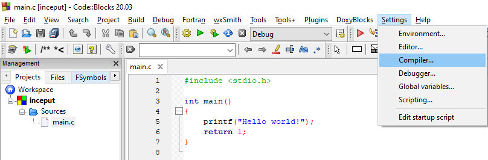
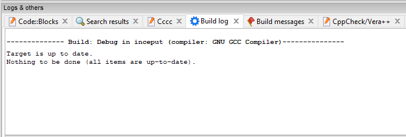
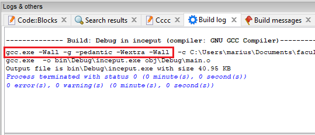
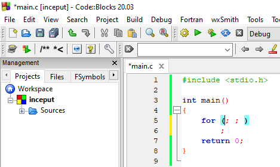

# Laboratorul 2

### ⚠ Puneți cât mai multe întrebări! Nu există întrebări greșite.
#### Semnalați orice fel de greșeli găsiți!

# Cuprins
## [Modificăm opțiunile compilatorului](#modificăm-opțiunile-compilatorului-1)
## [Programe discutate](#programe-discutate-1)
## [Exerciții](#exerciții-1)
## [Întrebări, erori și orice nu a fost acoperit deja](#întrebări-erori-diverse)
## [Resurse recomandate](#resurse-recomandate-1)

## Modificăm opțiunile compilatorului

Ne dorim să scriem cod cât mai corect. Un prim pas în acest sens este să nu ignorăm mesajele de avertisment de la compilator.

Compilatorul nu ne va ajuta dacă nu îi cerem în mod explicit asta. Primul pas este să accesăm fereastra pentru setările compilatorului:



Al doilea pas este să bifăm opțiunile dorite din rubrica `Warnings`: `-Wall`, `-Wextra` și `-pedantic`. Acel `-std=c99` este opțional.


Pasul al treilea este să salvăm aceste setări apăsând butonul `OK`.

Ultimul pas, verificăm că opțiunile chiar sunt folosite. Aici nu ne interesează să executăm programul, ci doar să îl compilăm (⚙):


Dacă în zona de mesaje vă spune că nu e nimic de compilat și că `Target is up to date`:



Adăugați și ștergeți un spațiu ca să fie modificată sursa, apoi compilați din nou (⚙):



Verificați că vă apar `-Wall`, `-Wextra` și `-pedantic`; nu contează ordinea aici.

Mie îmi apare de două ori `-Wall` pentru că este setat și la nivel de proiect, și la nivel global (implicit pentru toate proiectele). Nu este ceva grav. Despre acel `-g` vom discuta mai târziu. Este folosit pentru depanare (debugging).

---
<details>
  <summary>Detalii despre standarde</summary>
  Puteți bifa și <code>-std=c99</code> din rubrica <code>General</code>, dacă nu folosiți Windows :smile: (încă nu este implementat). Din acest punct de vedere, mai sigur este <code>-std=c90</code> pentru cod cât mai portabil.
  Standardele C11 și C17 nu sunt implementate complet de multe compilatoare.
  <br><br>
  La laborator, vom încerca să folosim doar părțile din C99 care funcționează și pe Windows. Deși pare surprinzător, lucrurile stau astfel deoarece nu prea există cerere pentru îmbunătățirile aduse în noile standarde, din motive comerciale. Microsoft nu a considerat prioritară implementarea standardelor C mai noi de C90, concentrându-se pe implementarea standardelor de C++.
  <br><br>
  <details>
    <summary>Și mai multe detalii</summary>
    Le adaug numai dacă dorește cineva.
  </details>
</details>

## Programe discutate
[Înapoi la cuprins](#cuprins)

### [Instrucțiuni decizionale (iar)](#din-nou-if)
### [Sau, în unele situații, `switch`](#switch)
### [Instrucțiuni repetitive: `for`](#for)
### [Instrucțiuni repetitive: `while`](#while)
### [Instrucțiuni repetitive: `do`...`while`](#dowhile)
### [Operații pe biți](#operații-pe-biți-1)

### Din nou `if`

Pentru a ne aminti instrucțiunea `if`, avem următorul program:
```c
#include <stdio.h>

int main()
{
    int temperatura;
    printf("Introduceti temperatura (grade Celsius): ");
    scanf("%d", &temperatura);

    if(temperatura < -20)
        puts("Prea frig!");
    else if(temperatura < -5)
        puts("Friiig!");
    else if(temperatura < 10)
        puts("Frig...");
    else if(temperatura < 25)
    {
        puts("Ideal!");
        if(temperatura > 20)
        {
            puts("Si poate e si soare!");
        }
    }
    else if(temperatura < 35)
        puts("Cald...");
    else
        puts("Prea cald!");
    return 0;
}
```
Citiți-l cu atenție pentru a înțelege ce face, apoi executați și faceți câteva modificări (dacă doriți).

Am folosit funcția `puts` în loc de `printf` deoarece nu dorim să formatăm nimic, ci doar să afișăm un mesaj simplu. De asemenea, `puts` adaugă automat `\n`.

Dacă declarăm `temperatura` de un tip de date real, programul se complică. Haideți să vedem de ce.

#### `float`, `double` sau `long double`?
Răspunsul corect este "depinde". Dacă avem nevoie de calcule cât mai precise, folosim `double` sau `long double` (sau alte biblioteci specializate, de exemplu [asta](https://github.com/creachadair/imath)). `long double` oferă o precizie cel puțin la fel de bună ca `double`. Dacă anumite condiții sunt îndeplinite, `long double` este mai precis decât `double`. Printre condițiile respective se numără un hardware adecvat, un compilator care să știe să genereze cod mașină/de asamblare special pentru acel hardware și instalarea de biblioteci corespunzătoare (a se vedea și comentariul de [aici](https://stackoverflow.com/questions/16859500)).

Exemple: calcule științifice, financiare.

---

Dacă nu ne interesează atât de tare un rezultat precis, dar vrem să fie efectuat mai rapid și să economisim memorie, folosim `float`.

Exemple: aplicații grafice (jocuri), rețele neuronale.

Presupunem că un byte are 8 biți. Standardul specifică 32 de biți (4 bytes) pentru fiecare `float`, 64 de biți (8 bytes) pentru fiecare `double`. Pe calculatorul meu obțin că un `long double` are 12 bytes (96 de biți):
```c
#include <stdio.h>
#include <limits.h>

int main()
{
    printf("Un `long double` ocupa %zu bytes (%zu de biti).\n", sizeof(long double), CHAR_BIT*sizeof(long double));
    return 0;
}
```
Dacă primiți warning că `z` este operator de conversie necunoscut, înlocuiți `%zu` cu `%u` sau cu `%lu`, dar `%zu` este standard.

Update octombrie 2020: în urma unui update de Windows, `msvcrt.dll` a fost actualizat, iar `%zu` nu mai generează warning! 🎉

Fun fact: [standardul](https://stackoverflow.com/questions/81656/where-do-i-find-the-current-c-or-c-standard-documents) specifică doar că un byte are `CHAR_BIT` biți (biblioteca `<limits.h>`), care este *cel puțin* 8. Desigur, de obicei un byte este exact 8 biți și poate fi numit și octet. Altfel, dacă un byte nu are 8 biți, nu prea poate fi numit octet :smiley:

#### Comparații cu `==` între numere reale în virgulă mobilă?
Nu vrem așa ceva! De ce? Pentru că nu putem reprezenta exact numerele reale.
```c
// asa NU!
if(temperatura == 100)
    puts("Fierbe apa!");

// asa da, dar DEPINDE
// precizia pe care o avem la comparatii cu numere reale
double epsilon = 1e-5;  // 10^(-5) == 0.00001
if( ((temperatura - 100) < epsilon) || ((100 - temperatura) < epsilon) )
    puts("Fierbe apa!");
```
Putem simplifica codul de mai sus eliminând din paranteze, dacă știm [ce prioritate au operatorii](https://en.cppreference.com/w/c/language/operator_precedence): `-`, `<`, `||`.

Un mod ușor (dar un pic riscant) de a reține aceste reguli este să ne gândim care e cea mai probabilă interpretare a expresiei dacă nu sunt paranteze.

De exemplu, expresia `1 + 2 * 5` este echivalentă cu `1 + (2 * 5)` (adică 11) și nu cu `(1 + 2) * 5` (adică 15), ceea ce ar trebui să știm de la matematică. Dacă vrem să evaluăm o expresie în felul al doilea (ca `(1 + 2) * 5`), trebuie să punem paranteze **obligatoriu**.

Urmând aceeași analogie, operatorii matematici (`*`, `+`, `-` etc.) au prioritate mai mare decât operatorii de comparare (`>=`, `==` etc.), iar aceștia au la rândul lor prioritate mai mare decât operatorii logici (`&&`, `||`):
```c
double epsilon = 1e-5;
if(temperatura - 100 < epsilon || 100 - temperatura < epsilon)
    puts("Fierbe apa!");
```

Sau folosim funcția [`fabs`](https://en.cppreference.com/w/c/numeric/math/fabs) din biblioteca [`<math.h>`](https://en.cppreference.com/w/c/numeric/math):
```c
double epsilon = 1e-5;
if(fabs(temperatura - 100) < epsilon)
    puts("Fierbe apa!");
```

Soluția prezentată mai sus este acceptabilă pentru ce veți face în facultate. Momentan e important doar să știți că acest subiect este unul complicat. Ca punct de plecare, puteți începe să citiți de [aici](https://floating-point-gui.de) (pentru vizualizări [aici](https://mcmarius.github.io/ieee754-visualization/) - am adaptat un pic [codul](https://github.com/mcmarius/ieee754-visualization)), iar strict pentru comparații [aici](https://floating-point-gui.de/errors/comparison/). Desigur, lucrurile sunt complicate, dar nu e bine nici să împușcăm musca cu tunul dacă nu e cazul.

### `switch`
[Înapoi la programe](#programe-discutate-1)

Instrucțiunea `switch` este asemănătoare cu instrucțiunea `if` și este utilă atunci când vrem să testăm egalitatea unei variabile cu mai multe valori posibile.

Instrucțiunea `break` iese din `switch`. În caz contrar, execuția continuă pe următoarea ramură *fără verificarea condiției*. Nu trebuie să mă credeți pe cuvânt. Încercați să vedeți ce se întâmplă.

Puteți să mă corectați, nu m-am mai uitat pe hartă pentru a face următorul exemplu corect din punct de vedere "cartografic":
```c
#include <stdio.h>

int main()
{
    int km;
    puts("Ce kilometru arata borna?");
    scanf("%d", &km);
    switch(km)
    {
        case 80:
            puts("Ne apropiem de Ploiesti!");
            break;
        case 120:
            puts("Ne apropiem de Comarnic!");
            break;
        case 150:
            puts("Ne apropiem de Sinaia!");
            break;
        case 170:
            puts("Ne apropiem de Predeal!");
            break;
        default:
            puts("Nu am idee unde sunt!");
            break;
    }
    return 0;
}
```

Această instrucțiune este utilizată de obicei cu tipuri de date enumerabile ([`enum`](https://en.cppreference.com/w/c/language/enum)). Acestea reprezintă numere cu "etichete" și ne ajută să avem un cod mai ușor de înțeles și de modificat pe viitor. Am putea la fel de bine să folosim valori întregi direct în condiții, ca în programul de mai sus, însă devine dificil de urmărit dacă avem multe cazuri.

Să vedem și al doilea exemplu:
```c
#include <stdio.h>
#include <stdbool.h>

enum Moneda { RON, EUR, USD, BGN, HUF, XBT };

const char* afis_moneda(enum Moneda);  // linia 6

int main()
{
    int mon;
    enum Moneda moneda;
    double suma;
    bool schimb = true;
    printf("Introduceti suma: ");
    scanf("%lf", &suma);
    puts("In ce moneda vreti sa schimbati?");
    puts("0 - RON, 1 - EUR, 2 - USD, 3 - BGN");
    scanf("%d", &mon);
    moneda = mon;   // linia 19
    switch(moneda)
    {
        case EUR:
            suma /= 4.83;
            break;
        case USD:
            suma /= 4.16;
            break;
        case BGN:
            suma /= 2.47;
            break;
        case RON:
        default:
            schimb = false;
            puts("Nu am efectuat schimbul!");
            break;
    }
    if(schimb)
        printf("Suma dupa schimb: %.3f %s", suma, afis_moneda(moneda));  // linia 38
    return 0;
}

const char* afis_moneda(enum Moneda m)
{
    switch(m)
    {
        case RON: return "Romanian New Leu (RON)";
        case EUR: return "Euro (€)";
        case USD: return "US Dollar ($)";
        case BGN: return "Bulgarian Lev (BGN)";
        case HUF: return "Hungarian Forint (HUF)";
        case XBT: return "Bitcoin (XBT)";
        default: return "";
    }
}
```

Observații:
- spre deosebire de `if`, aici sunt întotdeauna necesare acoladele; excepția ar fi un `switch` cu un singur `case`, dar e greșit (neavând `default`) și nu prea are sens
- dacă nu acoperim toate cazurile și nu avem o ramură implicită (cu `default`), ar trebui să primim un warning de la compilator, deoarece aceasta poate semnifica o greșeală de programare
- am declarat un nou tip de date enumerabil; întrucât este un tip de date definit de noi, atunci când declarăm variabile de acest tip este necesar și cuvântul cheie `enum`: `enum Moneda moneda;`
- pentru a folosi tipul de date `bool` și constantele `true` și `false`, am inclus `<stdbool.h>` (C99); spre deosebire de C++, limbajul C nu a avut de la început `bool`; tot spre deosebire de C++, în C constantele `true` și `false` sunt de fapt numerele întregi 0 și 1
- deși variabilele de tipuri de date enumerabile trebuie să se comporte exact ca variabilele întregi și să poată fi folosite în locul acestora, nu putem citi direct o variabilă de tip enumerabil cu `scanf`; este necesară conversia explicită de la linia 19
- `op1 /= op2` este prescurtare pentru `op1 = op1 / op2`, unde `op1` și `op2` sunt niște operanzi
- atunci când declarăm o funcție (linia 6), este suficient să specificăm tipul de date al parametrilor, numele fiind opțional
  - definiția funcției `afis_moneda` (corpul cu acolade) am scris-o la sfârșitul programului pentru a avea funcția `main` la început, "în prim plan"
  - compilatorul parcurge sursa de sus în jos; dacă nu avem declarația de la linia 6 (o comentăm), vom primi eroare la linia 38 (de fapt warning), întrucât în acest punct funcția `main` nu are de unde să știe dacă funcția `afis_moneda` chiar există
  - declarația de la linia 6 este o "promisiune" că undeva în codul nostru sursă (eventual în alt fișier) avem și definiția completă a funcției

### `for`
[Înapoi la programe](#programe-discutate-1)

Forma uzuală a instrucțiunii `for` este:
```c
for(<expresie_initializare>; <expresie_conditionala>; <expresie_iteratie>)
{
    instructiuni;
}
```
`<expresie_initializare>` se execută o singură dată, la început. Apoi se verifică dacă `<expresie_conditionala>` este diferită de 0 (adică este adevărată). Cât timp expresia condițională este adevărată, este executat blocul de `instructiuni`, iar apoi este evaluată `<expresie_iteratie>`. Se continuă cu verificarea expresiei condiționale și executarea blocului de `instructiuni` și a `<expresie_iteratie>` până când `<expresie_conditionala>` devine falsă.

Acoladele pot lipsi dacă avem o singură instrucțiune.

Putem omite oricare dintre aceste 4 părți ale unei instrucțiuni `for`, însă este obligatoriu să punem ambele `;`. Dacă nu avem `instructiuni`, atunci punem fie `{}`, fie `;` după paranteza închisă de la `for`.

Pentru a înțelege această instrucțiune, să ne uităm la programul de mai jos. 
```c
#include <stdio.h>

int main()
{
    int i, nr_viteze;
    nr_viteze = 6;
    puts("Am pornit motorul\n");
    for(i = 1; i <= nr_viteze; i++)
        printf("Viteza %d\n", i);
    puts("----------");  // linia 10
    for(i = nr_viteze; i > 0; --i)
        printf("Viteza %d\n", i);
    puts("\nAm oprit motorul");
    return 0;
}
```

Observații:
- expresia `i++` este prescurtare pentru `i = i + 1` și întoarce `i`, iar `--i` este prescurtare pentru `i = i - 1` și întoarce `i - 1`
  - rezultatul expresiei nu este folosit în situația de mai sus, însă variabila `i` se modifică
  - diferența dintre operatorul prefix (`<op>i`, exemplu `++i`) și operatorul postfix (`i<op>`, exemplu `i++`) este aceea că pentru operatorul postfix este necesară o copie suplimentară pentru a reține valoarea anterioară; pentru limbajul C, în prezent este irelevant acest aspect din punctul de vedere al performanței, deoarece compilatorul face diverse optimizări
- instrucțiunea de la linia 10 este doar ca să vedem mai ușor unde se termină afișarea de la primul `for`
- putem avea mai multe atribuiri: în loc de `i = 1` putem avea `i = 1, j = 20` (presupunând că am declarat variabila `j`)
- putem avea mai multe condiții: în loc de `i <= nr_viteze` putem avea `i <= nr_viteze && j > 0`
- putem avea o expresie mai complexă: în loc de `i++` putem avea `i++, j -= 3`
- putem scrie mai rapid un `for` în Code::Blocks dacă apăsăm `Ctrl`+`J` după ce apar sugestii ca mai jos


După ce apăsăm `Ctrl`+`J`, ar trebui să obținem



Este subiectiv dacă vă ajută sau mai mult vă încurcă; puteți configura aceste shortcuts ca să vă genereze implicit mai mult cod de "umplutură".

### `while`
[Înapoi la programe](#programe-discutate-1)

Instrucțiunea `while` este asemănătoare cu instrucțiunea `for`, însă ceva mai generală. Forma uzuală este următoarea:
```c
while(<expresie_conditionala>)
{
    instructiuni;
}
```

Același comentariu ca mai sus referitor la acolade (pot lipsi dacă avem o singură instrucțiune).

Exemplu:
```c
#include <stdio.h>
#include <stdbool.h>

int main()
{
    bool absolvent = false;
    int ani = 0;
    while(!absolvent)
    {
        if(++ani == 4)
            absolvent = true;
        printf("Sunt in anul %d\n", ani);
    }
    printf("Gata!\n");  // linia 14
    return 0;
}
```

Observație:
- întâi se evaluează expresia condițională (în acest caz `!absolvent`), iar dacă expresia este adevărată, se execută și instrucțiunile
  - acești pași continuă până când expresia condițională nu mai este adevărată
- operatorul `!` neagă expresia în fața căreia este pus
  - inițial, `absolvent` nu este o expresie adevărată, prin urmare `!absolvent` este adevărată
  - după ce `absolvent` devine `true`, expresia `!absolvent` devine falsă, iar corpul instrucțiunii `while` nu se mai execută și se trece la instrucțiunea următoare de la linia 14

### `do`...`while`
[Înapoi la programe](#programe-discutate-1)

Instrucțiunea `do`...`while` este asemănătoare cu instrucțiunea `while`, cu diferența că întâi se execută blocul de instrucțiuni, iar *după* se verifică instrucțiunea condițională. De asemenea, este necesar să punem `;` la sfârșit. Putem omite acoladele dacă avem o singură instrucțiune (deși este mai rară această situație). Forma generală este:
```c
do
{
    instructiuni;
} while(<expresie_conditionala>);
```

Exemplu:
```c
#include <stdio.h>

int main()
{
    int nr_frunze = 100;
    do
    {
        printf("Copacul mai are %d frunze...\n", nr_frunze);
        nr_frunze -= 15;
    } while(nr_frunze > 30);
    puts("A venit toamna!");
    return 0;
}
```

Exemplu cu `break`:
```c
#include <stdio.h>

int main()
{
    int nr_frunze = 100;
    do
    {
        nr_frunze -= 15;
        if(nr_frunze == 55)
            break;
        printf("Copacul mai are %d de frunze...\n", nr_frunze);
    } while(nr_frunze > 30);
    puts("A venit toamna mai repede!");
    return 0;
}
```

Observații:
- instrucțiunile care urmează după `break` din cadrul blocului de instrucțiuni **nu** se mai execută, se iese direct din instrucțiunea repetitivă
- dacă avem mai multe instrucțiuni repetitive îmbricate (una în interiorul alteia), instrucțiunea `break` ne scoate doar "un nivel"; vom vedea mai multe exemple mai târziu

Exemplu cu `continue`:
```c
#include <stdio.h>

int main()
{
    int nr_frunze = 100;
    do
    {
        printf("Copacul mai are %d de frunze...\n", nr_frunze);
        if(nr_frunze == 55)
        {
            puts("Dar vremea e frumoasa!");
            nr_frunze += 10;
            continue;
        }
        nr_frunze -= 15;
    } while(nr_frunze > 30);
    puts("A venit toamna mai tarziu!");
    return 0;
}
```

Observații:
- după instrucțiunea `continue`, execuția continuă de la începutul acoladei instrucțiunii repetitive din care face parte


### Operații pe biți
[Înapoi la programe](#programe-discutate-1)
#### [Operatorul `<<`](#operatorul--deplasare-la-stânga)
#### [Operatorul `>>`](#operatorul--deplasare-la-dreapta)

În calculator, informația este reprezentată în baza 2 (binar). Operatorii pe biți acționează la nivelul fiecărui bit. În limbajul C, [acești operatori](https://en.cppreference.com/w/c/language/operator_arithmetic) au sens numai pentru numerele întregi (cu sau fără semn).

De exemplu, numărul `19` (baza 10) este `10011` în baza 2, adică `1*2^4 + 0*2^3 + 0*2^2 + 1*2^1 + 1*2^0 = 16 + 0 + 0 + 2 + 1`.

Dacă ne referim la tipul de date `int`, acesta are de obicei 32 de biți (standardul cere doar să aibă >= 16 biți).

Dacă vrem să fim riguroși, folosim `int32_t` (din `<stdint.h>`) care are *întotdeauna* 32 de biți. Pe de altă parte, nu este garantat că avem acces întotdeauna la `<stdint.h>`, pe când `int` avem în toate implementările.

Astfel, numărul 19 în binar este `00000000000000000000000000010011` în reprezentare [big-endian](https://en.wikipedia.org/wiki/Endianness), adică cifra cea mai semnificativă este în stânga (citim de la stânga la dreapta).

Totuși, pentru a fi mai simplu de înțeles, în exemplele următoare vom scrie doar 8 cifre, deci 19 în binar va fi `00010011`.

De ce sunt importante operațiile pe biți? Simplu, deoarece sunt foarte rapide. De ce sunt foarte rapide? Pentru că sunt "aproape" de hardware.

#### Operatorul `~` (NOT)
~|0|1
-|-|-
‍|1|0

Exemplu:
```
 19 | 0 0 0 1 0 0 1 1
---------------------
~19 | 1 1 1 0 1 1 0 0
```

#### Operatorul `&` (AND)
**&**|0|1
-----|-|-
**0**|0|0
**1**|0|1

Exemplu:
```
 19 | 0 0 0 1 0 0 1 1  &
---------------------
 11 | 0 0 0 0 1 0 1 1
---------------------
    | 0 0 0 0 0 0 1 1
```

#### Operatorul `|` (OR)
**\|**|0|1
-----|-|-
**0**|0|1
**1**|1|1

Exemplu:
```
 19 | 0 0 0 1 0 0 1 1  |
---------------------
 11 | 0 0 0 0 1 0 1 1
---------------------
    | 0 0 0 1 1 0 1 1
```

#### Operatorul `^` (XOR)
**^**|0|1
-----|-|-
**0**|0|1
**1**|1|0

Exemplu:
```
 19 | 0 0 0 1 0 0 1 1  ^
---------------------
 11 | 0 0 0 0 1 0 1 1
---------------------
    | 0 0 0 1 1 0 0 0
```

#### Operatorul `<<` (Deplasare la stânga)
[Înapoi la Operații pe biți](#operații-pe-biți-1)

Exemplu (presupunem că avem doar 8 biți și un întreg **fără** semn):
```
   19   | 0 0 0 1 0 0 1 1
-------------------------
19 << 1 | 0 0 1 0 0 1 1 0
-------------------------
19 << 2 | 0 1 0 0 1 1 0 0
-------------------------
19 << 3 | 1 0 0 1 1 0 0 0
-------------------------
19 << 4 | 0 0 1 1 0 0 0 0
-------------------------
   ...
-------------------------
19 << 7 | 1 0 0 0 0 0 0 0
-------------------------
19 << 8 | 0 0 0 0 0 0 0 0 ??? comportament nedefinit
```

Verificăm:
```c
#include <stdio.h>
#include <stdint.h>

void deplasare_st(uint8_t nr, unsigned sh)
{
    uint8_t res;
    res = nr << sh;
    printf("%u << %u: %u\n", nr, sh, res);
}

int main()
{
    uint8_t nr = 19;
    for (int i = 0; i < 8; i++)
        deplasare_st(nr, i);
    return 0;
}
```

Observații:
- dacă `sh` este negativ sau e mai mare sau egal cu numărul de biți, ai lui `nr`, avem [**comportament nedefinit**](https://en.cppreference.com/w/c/language/behavior), adică nu avem vreo garanție că programul face ce trebuie; un program *corect* nu conține comportament nedefinit
  - acest lucru este valabil și pentru operatorul de deplasare la dreapta `>>`
  - am lăsat la sfârșit câteva link-uri dacă vreți să citiți mai multe despre asta
- operatorul `<<` realizează înmulțirea cu o putere a lui 2: `x << p` îl înmulțește pe `x` cu `2^p`
- dacă tipul de date al operandului din stânga (`nr`) este fără semn, deplasarea la stânga se realizează în modul descris mai sus
- dacă tipul de date al operandului din stânga este cu semn, atunci:
  - dacă operandul din stânga este negativ, comportament nedefinit 💥
  - dacă operandul din stânga este pozitiv, avem comportament nedefinit atunci când un bit din număr s-ar duce "peste" bitul de semn (primul bit); pe exemplul de mai sus, asta s-ar întâmpla de exemplu la `19 << 3` (ar putea fi -104, 24, ??? sau un portal către o altă dimensiune)

#### Operatorul `>>` (Deplasare la dreapta)
[Înapoi la Operații pe biți](#operații-pe-biți-1)

Exemplu (presupunem din nou că avem doar 8 biți):
```
   19   | 0 0 0 1 0 0 1 1
-------------------------
19 >> 1 | 0 0 0 0 1 0 0 1
-------------------------
19 >> 2 | 0 0 0 0 0 1 0 0
-------------------------
19 >> 3 | 0 0 0 0 0 0 1 0
-------------------------
19 >> 4 | 0 0 0 0 0 0 0 1
-------------------------
19 >> 5 | 0 0 0 0 0 0 0 0
```

Dacă avem un întreg cu semn (⚠ primul bit este bitul de semn și este 1 dacă numărul este negativ), rezultatul depinde de implementare, iar majoritatea acestora procedează astfel, păstrând semnul (conform cppreference.com):
```
   -19   | 1 1 1 0 1 1 0 1
--------------------------
-19 >> 1 | 1 1 1 1 0 1 1 0
--------------------------
-19 >> 2 | 1 1 1 1 1 0 1 1
--------------------------
-19 >> 3 | 1 1 1 1 1 1 0 1
--------------------------
-19 >> 4 | 1 1 1 1 1 1 1 0
--------------------------
-19 >> 5 | 1 1 1 1 1 1 1 1
```

Programul aferent (rulați, apoi înlocuiți 19 cu -19):
```c
#include <stdio.h>
#include <stdint.h>

void deplasare_dr(int8_t nr, unsigned sh)
{
    int8_t res;
    res = nr >> sh;
    printf("%d >> %u: %d\n", nr, sh, res);
}

int main()
{
    int8_t nr = 19;
    for (int i = 0; i < 8; i++)
        deplasare_dr(nr, i);
    return 0;
}
```

Observații:
- operatorul `>>` realizează împărțirea la o putere a lui 2: `x >> p` îl împarte pe `x` la `2^p`
- numerele negative sunt reprezentate în complementul lui 2; citiți mai multe despre asta [aici](https://en.wikipedia.org/wiki/Two's_complement) și [aici](https://stackoverflow.com/questions/791328/how-does-the-bitwise-complement-operator-tilde-work)
  - pe scurt, complementul lui 2 se determină astfel:
    - se aplică NOT (~), iar apoi
    - se adună 1
  - pentru verificare: https://www.exploringbinary.com/twos-complement-converter/

## Exerciții
[Înapoi la cuprins](#cuprins)

- folosiți `break` și/sau `continue` în cadrul unei instrucțiuni `for`/`while`
- folosiți instrucțiuni repetitive îmbricate pentru afișarea tuturor perechilor de două numere de la 1 la 5

Exerciții din PDF (problemele 1-3 se vor rezolva folosind operații pe biți):
1. Pentru valori întregi citite de la tastatură să se tiparească valoarea corespunzătoare în binar. Pentru verificare, folosiți aplicația "Calculator".

2. Se citesc 2 numere întregi `x` și `n` unde `n` este între 0 si 15. Să se afișeze: bitul `n` din `x`, numărul `x` în care se setează bitul `n`, numărul `x` în care se șterge bitul `n`, numărul `x` în care se complementează bitul `n`.

3. Se citesc întregii `x`, `y`, `n`, `p`. Să se copieze în `x`, începând din poziția `p`, ultimii `n` biți din `y` și să se afișeze noua valoare a lui `x`.

4. Scrieți un program care primește ca input de la tastatură scrierea unui număr în baza 2 și calculează direct scrierea acestuia în baza 16 (nu mai trece prin baza intermediară 10). Realizați acest lucru inversând cele două baze (input – scrierea în baza 16, output – scrierea în baza 2).

5. Se citesc numere naturale până la întâlnirea numărului 0. Să se afișeze toate perechile de numere consecutive citite cu proprietatea că al doilea număr reprezintă restul împărțirii primului număr la suma cifrelor sale.

6. Se citește de la tastatură un număr natural `p`. Să se determine toate perechile distincte de numere întregi `(i, j, k)` cu proprietatea că ele pot reprezenta laturile unui triunghi de perimetru `p`. Folosiți maxim două instrucțiuni `for`.

## Întrebări, erori, diverse
[Înapoi la cuprins](#cuprins)

### `for`-ul meu nu se oprește!
Posibile greșeli:
```c
unsigned i;
for(i = 10; i >= 0; i--)
  // instructiuni
```
Acest cod probabil se va executa la infinit: un tip de date fără semn reprezintă doar numere pozitive: astfel, condiția `i >= 0` este întotdeauna adevărată, deoarece după ce `i` este 0, `i--` îl face `UINT_MAX` (din `<limits.h>`) din cauza integer underflow, adică toți biții ajung din nou să fie 1 (se aplică operația modulo `UINT_MAX+1`).

Ca fapt divers, integer overflow/underflow pentru tipuri de date întregi *cu semn* reprezintă comportament nedefinit 💥

* 🚧

## Resurse recomandate
- [cppreference.com](https://en.cppreference.com/w/c)
- [StackOverflow](https://stackoverflow.com/questions/tagged/c?tab=Votes)
- [C FAQ](http://c-faq.com/questions.html)
- [C99 standard](http://www.open-std.org/jtc1/sc22/wg14/www/docs/n1256.pdf) (doar să îl răsfoiți un pic)
- Despre comportamentul nedefinit, mai multe [aici](https://stackoverflow.com/questions/2397984/undefined-unspecified-and-implementation-defined-behavior), [aici](https://blog.regehr.org/archives/213) și [aici](http://blog.llvm.org/2011/05/what-every-c-programmer-should-know.html)

