Scop: vom scrie o variantă de Pong.

### [Biblioteci externe](#biblioteci-externe-1)
### [Planificarea structurii codului](#planificarea-structurii-codului-1)
### [Implementarea](#implementarea-1)

### Biblioteci externe

Pași:
- găsirea unei biblioteci care să facă ce dorim
- compilarea bibliotecii (de multe ori necesară)
- includerea fișierelor header pentru a avea acces la interfața oferită de bibliotecă
- adăugarea căilor către fișierele header și către fișierele binare
- compilarea programului nostru și legarea (linking-ul) bibliotecilor externe
- executarea programului dacă biblioteca este legată dinamic (DLLs pe Windows, shared objects pe *nix)

-----


Pas opțional: update la o versiune [mai nouă](http://www.winlibs.com/#download-release) a compilatorului.

Pentru partea de grafică, vom încerca CSFML. Dacă nu reușim, vom încerca ulterior cu SDL. Un punct de plecare pentru a găsi diverse biblioteci este [acesta](https://github.com/oz123/awesome-c).

CSFML poate fi descărcat de [aici](https://www.sfml-dev.org/download/csfml/). Mai exact, eu voi folosi [varianta pe 64 de biți](https://www.sfml-dev.org/files/CSFML-2.5-windows-64-bit.zip). Dacă aveți un MinGW mai vechi, este posibil să aveți versiunea pe 32 de biți. Dacă nu reușim așa, vom compila codul sursă.

Vom structura proiectul în felul următor:
```
pong
├───ext
│   └───CSFML-2.5
│       ├───bin
│       ├───include
│       └───lib
├───pong.cbp
└───README.md
```

Directorul rădăcină se va numi `pong`. În directorul `ext` vom pune toate bibliotecile externe. În structura de mai sus, în folderul `CSFML-2.5` am pus ce am extras din arhiva `CSFML-2.5-windows-64-bit.zip`.

Vom face și un fișier `README.md` unde vom scrie documentația. Fișierul `.cbp` este fișierul de proiect pentru Code::Blocks. Puteți folosi orice editor doriți.

Unul dintre primii pași pe care îi facem atunci când vrem să folosim o bibliotecă externă este să scriem un program de test și să vedem dacă merge. În cazul nostru, acest program va fi următorul:
```c
#include <stdio.h>
#include <SFML/Graphics.h>

int main()
{
    sfTime t = {1e6};
    sfSleep(t);
    printf("Hello world!\n");
    return 0;
}
```
Programul "doarme" timp de o secundă, iar apoi afișează un mesaj. Dacă încercăm să compilăm, vom primi următoarea eroare:

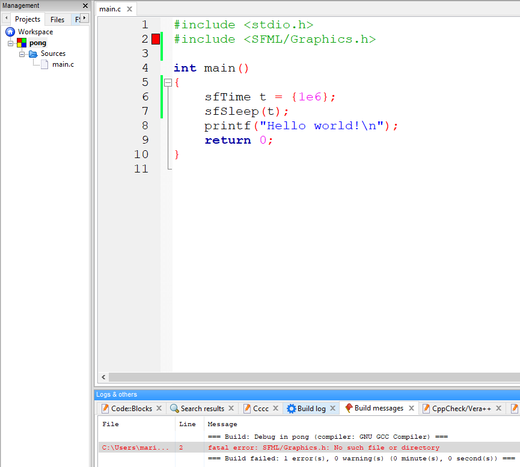

Trebuie să îi spunem compilatorului unde găsește aceste fișiere header: click dreapta pe proiect, `Build options`:

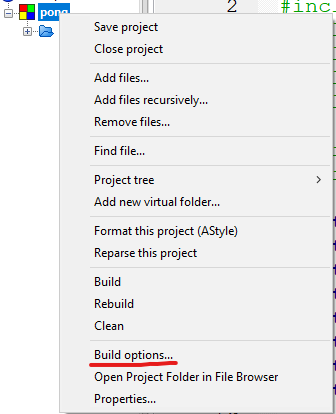

Apoi `Search directories`->`Compiler`->`Add`:

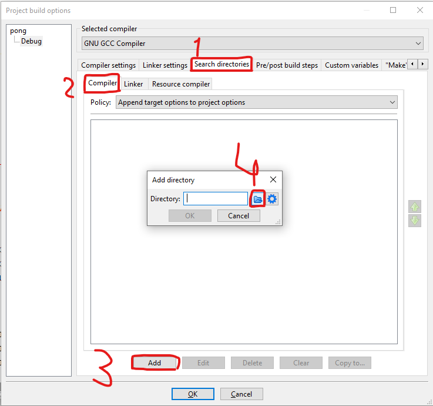

Calea va fi folderul `include` din folderul `CSFML-2.5` (care se află în `ext`)

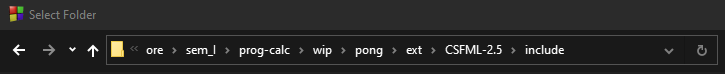

După aceea, dăm pe butoanele de `ok`. Dacă întreabă, putem să îi spunem să pună calea relativă. Pentru a verifica dacă am pus calea corect, încercăm să compilăm. Vom primi un mesaj de eroare, însă este altă eroare 😄

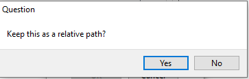


Totuși, ca să verificăm ce cale a fost setată, ne putem uita pe tab-ul `Build log`. Calea este adăugată cu opțiunea `-I` (i mare urmat de nume director):

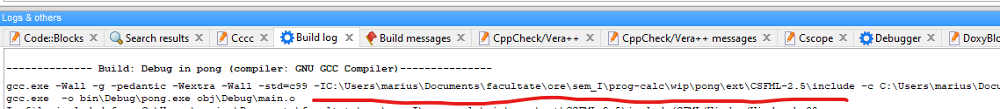

Dacă ați selectat calea relativă, veți vedea `-Iext\CSFML-2.5\include`.

Dacă după acest pas nu primiți sugestii în editor (cu <kbd>Ctrl</kbd>+<kbd>Space</kbd>), atunci click dreapta pe proiect și `Reparse this project`.

Acum trebuie să rezolvăm eroarea cu `undefined` ceva. I-am spus compilatorului unde să găsească fișierele header, însă acelea conțin doar niște declarații. Trebuie să spunem și unde este implementarea. La fel ca mai devreme, click dreapta pe proiect, `Build options`, apoi `Linker settings`->`Add`. Vom adăuga fișierele din folderul `lib` (subfolderul `gcc` deoarece folosim compilatorul GCC) din CSFML. Pentru programul demo de mai sus ar fi necesar doar `libcsfml-system`, însă pentru simplitate le vom adăuga pe toate:

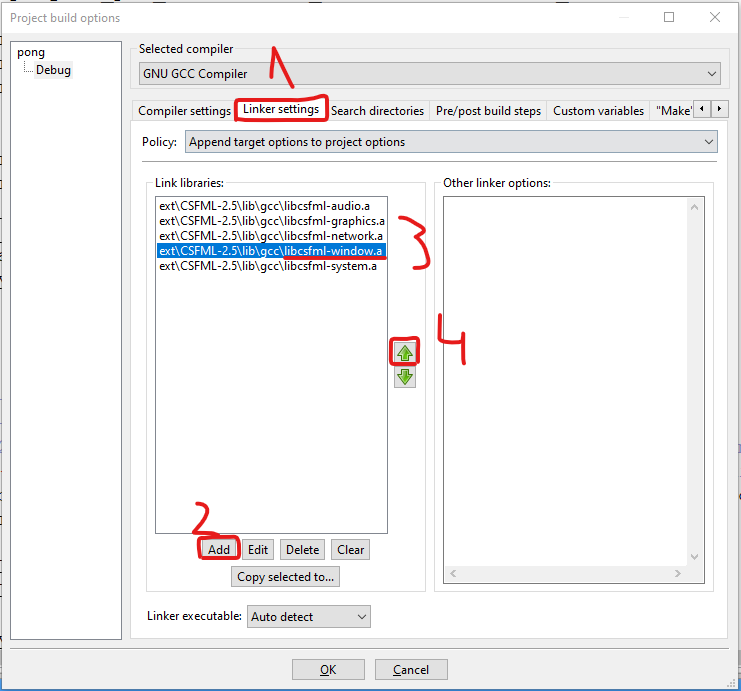

**Important! `libcsfml-system` trebuie să fie ultima în listă, iar `libcsfml-graphics` trebuie să apară înaintea `libcsfml-window`!**

De ce? Pentru că GCC vrea ca bibliotecile care depind de alte biblioteci să apară *înaintea* bibliotecilor de care depind. În acest caz, toate cele 4 depind de `libcsfml-system`, iar `libcsfml-graphics` depinde de `libcsfml-window`.

⚠ Observație: în proiecte mai serioase vom adăuga numai strictul necesar!

În acest punct, compilarea va reuși. Putem să ne uităm pe `Build log` să vedem că sunt adăugate fișierele `.a` (de la archive). Totuși, dacă executăm programul, vom primi următoarea eroare:

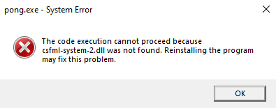

Trebuie să copiem în folderul `bin\Debug` (creat de Code::Blocks) fișierele `.dll` din folderul `bin` din CSFML. Le copiem din File Explorer. Trebuie să fie în același director cu executabilul nostru (`pong.exe` în cazul de față).

După acest pas, lucrurile par să meargă. Dacă totuși apar probleme, o primă soluție este să compilăm noi și biblioteca externă. Dacă nici asta nu reușește, încercăm să folosim alt compilator și apoi reluăm pașii discutați. De obicei, versiunile mai noi de compilatoare au mai puține bug-uri.

⚠ Observație: pe repository-ul de pe github nu am adăugat bibliotecile externe, deoarece pot ocupa destul de mult spațiu. ~Le voi adăuga pentru proiectul demo final, însă aș vrea să fac asta folosind git-lfs și nu am apucat să îl configurez.~ Voi furniza direct fișierele binare în [această secțiune](https://github.com/mcmarius/prog-calc/releases).

-----

`[2020-12-25]` În episodul următor vom explora ce ne oferă SFML. Sărbători fericite!

-----

### Planificarea structurii codului

Înainte să ne apucăm de implementare, trebuie să avem o idee mai clară despre ce vrem să obținem.

Chiar dacă jocul Pong este relativ simplu, este bine să fie structurat pentru a putea adăuga ușor funcționalități suplimentare. Putem identifica următoarele elemente:
- ecranul pe care se afișează toate elementele (totuși, am putea avea încă un ecran pentru meniu/scoruri)
- cei doi jucători
- mingea
- fileul
- pereții
- scorul fiecărui jucător (eventual și numele)

Funcționalități suplimentare care nu sunt atât de prioritare:
- pauză
- reținerea scorurilor
- unghiul și viteza cu care e lovită mingea influențează noua traiectorie

### Implementarea

#### [Elementele grafice](#elemente-grafice-1)
#### [Animații și coliziuni](#animații-și-coliziuni-1)

#### Elementele grafice

CSFML este foarte util, însă este doar o interfață pentru SFML care este scris în C++, iar pentru C nu există documentație oficială. Putem găsi [aici](https://epitech-2022-technical-documentation.readthedocs.io/en/latest/csfml.html) o listă neoficială a funcțiilor dacă nu ne prindem din exemplele de C++.

Un prim pas ar fi să construim o fereastră:
```c
#include <SFML/Graphics.h>

const int WIDTH = 1280;
const int HEIGHT = 720;

int main()
{
    sfVideoMode mode = {WIDTH, HEIGHT, 24};
    sfRenderWindow *window = sfRenderWindow_create(mode, "Pong", sfResize | sfClose, NULL);
    sfRenderWindow_setFramerateLimit(window, 60);

    while(sfRenderWindow_isOpen(window)) {
        sfEvent event;
        while (sfRenderWindow_pollEvent(window, &event))
        {
            if (event.type == sfEvtClosed)
                sfRenderWindow_close(window);
        }
    }

    sfRenderWindow_destroy(window);
    return 0;
}
```

Pentru comoditate, putem adăuga opțiunea de a închide fereastra dacă apăsăm tasta `escape` (<kbd>Esc</kbd>). În interiorul buclei exterioare, cea cu `isOpen`, adăugăm următoarele 2 instrucțiuni:
```c
if(sfKeyboard_isKeyPressed(sfKeyEscape))
    sfRenderWindow_close(window);
```

Pasul următor este să desenăm jucătorii. Îl vom desena întâi pe cel din stânga. Acesta este un dreptunghi. Îi setăm poziția și dimensiunea, apoi îl desenăm:
```c
#include <SFML/Graphics.h>

const int WIDTH = 1280;
const int HEIGHT = 720;
const int P1_X = 30;
const int P_Y = 100;
const int PSIZE_X = 30;
const int PSIZE_Y = 100;

int main()
{
    sfVideoMode mode = {WIDTH, HEIGHT, 24};
    sfRenderWindow *window = sfRenderWindow_create(mode, "Pong", sfResize | sfClose, NULL);
    sfRenderWindow_setFramerateLimit(window, 60);

    sfRectangleShape *player1 = sfRectangleShape_create();

    sfVector2f pos1 = {P1_X, (HEIGHT - PSIZE_Y) / 2};
    sfRectangleShape_setPosition(player1, pos1);

    sfVector2f size = {PSIZE_X, PSIZE_Y};
    sfRectangleShape_setSize(player1, size);

    while(sfRenderWindow_isOpen(window)) {
        if(sfKeyboard_isKeyPressed(sfKeyEscape))
            sfRenderWindow_close(window);
        sfEvent event;
        while (sfRenderWindow_pollEvent(window, &event))
        {
            if (event.type == sfEvtClosed)
                sfRenderWindow_close(window);
        }
        sfRenderWindow_clear(window, sfColor_fromRGB(60, 60, 60));
        sfRenderWindow_drawRectangleShape(window, player1, NULL);
        sfRenderWindow_display(window);
    }

    sfRectangleShape_destroy(player1);
    sfRenderWindow_destroy(window);
    return 0;
}
```
Am scăzut `PSIZE_Y` din `HEIGHT` pentru ca jucătorul să fie fix la jumătate. Rezultatul va fi următorul:

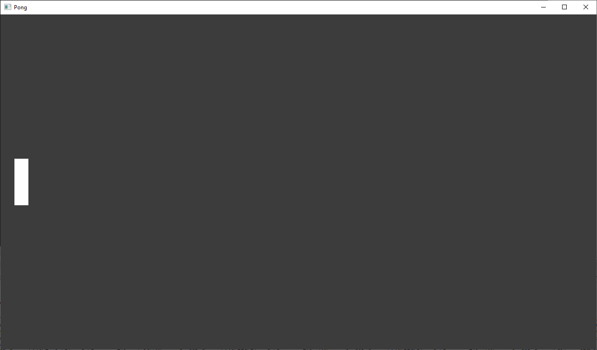

Similar, adăugăm și al doilea jucător, în partea opusă:
```c
const int P2_X = WIDTH - 2*P1_X;
// main
sfRectangleShape *player2 = sfRectangleShape_create();
sfVector2f pos2 = {P2_X, (HEIGHT - PSIZE_Y) / 2};
sfRectangleShape_setPosition(player2, pos2);
sfRectangleShape_setSize(player2, size);
// apoi draw și la sfârșit destroy
```

Am folosit constante pentru a le putea modifica ulterior într-un singur loc. Din nefericire, nu am reușit asta peste tot.

Mai adăugăm fileul (sub formă de dreptunghiuri aflate la o oarecare distanță), pereții și scorul:
```c
#include <stdio.h>
#include <stdlib.h>
#include <SFML/Graphics.h>

const int WIDTH = 1280;
const int HEIGHT = 720;
const int P1_X = 30;
const int P2_X = WIDTH - 2*P1_X;
const int P_Y = 100;
const int PSIZE_X = 30;
const int PSIZE_Y = 100;

int main()
{
    sfVideoMode mode = {WIDTH, HEIGHT, 24};
    sfRenderWindow *window = sfRenderWindow_create(mode, "Pong", sfResize | sfClose, NULL);
    sfRenderWindow_setFramerateLimit(window, 60);

    sfRectangleShape *player1 = sfRectangleShape_create();
    sfRectangleShape *player2 = sfRectangleShape_create();

    sfVector2f pos1 = {P1_X, (HEIGHT - PSIZE_Y) / 2};
    sfVector2f pos2 = {P2_X, (HEIGHT - PSIZE_Y) / 2};
    sfRectangleShape_setPosition(player1, pos1);
    sfRectangleShape_setPosition(player2, pos2);

    sfVector2f size = {PSIZE_X, PSIZE_Y};
    sfRectangleShape_setSize(player1, size);
    sfRectangleShape_setSize(player2, size);

    // fileu
    int n_points = HEIGHT / 30;
    sfRectangleShape **middle = malloc(n_points * sizeof(sfRectangleShape*));
    for(int i = 0; i < n_points - 1; i++) {
        middle[i] = sfRectangleShape_create();
        sfVector2f pos_mid = {WIDTH / 2, 30 * i + 25};
        sfVector2f size_mid = {10, 10};
        sfRectangleShape_setPosition(middle[i], pos_mid);
        sfRectangleShape_setSize(middle[i], size_mid);
    }

    sfRectangleShape *walls = sfRectangleShape_create();
    sfVector2f pos_wall = {10, 10};
    sfVector2f size_wall = {WIDTH - 20, HEIGHT - 20};
    sfRectangleShape_setFillColor(walls, sfTransparent);
    sfRectangleShape_setPosition(walls, pos_wall);
    sfRectangleShape_setSize(walls, size_wall);
    sfRectangleShape_setOutlineThickness(walls, 10);
    sfRectangleShape_setOutlineColor(walls, sfBlack);

    sfFont *scoreFont = sfFont_createFromFile("Digital7Mono-B1g5.ttf");
    if(!scoreFont) {
        printf("Error! File %s not found!\n", "Digital7Mono-B1g5.ttf");
        return 1;
    }

    int score_offset = 100;
    sfText *score_text1 = sfText_create();
    sfText *score_text2 = sfText_create();
    sfText_setFont(score_text1, scoreFont);
    sfText_setFont(score_text2, scoreFont);

    sfVector2f score1_pos = {WIDTH / 2 - score_offset, 20};
    // acel 25 e hardcoded... trebuie sa scadem cat ocupa scorul pe x
    sfVector2f score2_pos = {WIDTH / 2 + score_offset - 25, 20};
    sfText_setPosition(score_text1, score1_pos);
    sfText_setPosition(score_text2, score2_pos);

    sfText_setCharacterSize(score_text1, 72);
    sfText_setCharacterSize(score_text2, 72);
    sfText_setString(score_text1, "0");
    sfText_setString(score_text2, "0");

    while(sfRenderWindow_isOpen(window)) {
        if(sfKeyboard_isKeyPressed(sfKeyEscape))
            sfRenderWindow_close(window);
        sfEvent event;
        while (sfRenderWindow_pollEvent(window, &event))
        {
            if (event.type == sfEvtClosed)
                sfRenderWindow_close(window);
        }
        sfRenderWindow_clear(window, sfColor_fromRGB(60, 60, 60));
        // fileu
        for(int i = 0; i < n_points - 1; i++) {
            sfRenderWindow_drawRectangleShape(window, middle[i], NULL);
        }
        sfRenderWindow_drawRectangleShape(window, walls, NULL);
        sfRenderWindow_drawText(window, score_text1, NULL);
        sfRenderWindow_drawText(window, score_text2, NULL);
        sfRenderWindow_drawRectangleShape(window, player1, NULL);
        sfRenderWindow_drawRectangleShape(window, player2, NULL);
        sfRenderWindow_display(window);
    }

    sfRectangleShape_destroy(player1);
    sfRectangleShape_destroy(player2);

    // fileu
    for(int i = 0; i < n_points; i++)
        sfRectangleShape_destroy(middle[i]);
    free(middle);

    sfRectangleShape_destroy(walls);
    sfText_destroy(score_text1);
    sfText_destroy(score_text2);
    sfFont_destroy(scoreFont);

    sfRenderWindow_destroy(window);
    return 0;
}
```

Fontul l-am luat de [aici](https://www.fontspace.com/digital-7-font-f7087). M-am mai uitat pe [tutoriale](https://www.sfml-dev.org/tutorials/2.5/) și am adaptat la C.

După toate acestea, rezultatul este următorul:

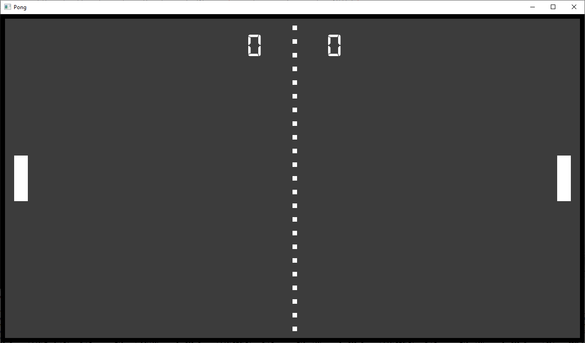

#### Animații și coliziuni

Înainte de a trece la animații, reorganizăm un pic codul pentru a putea fi mai ușor de înțeles și de extins ulterior. Cea mai importantă modificare este aceea că actualizăm poziția jucătorilor și scriem scorul **în bucla principală a jocului**, nu înaintea acesteia.

Ideea generală este următoarea:
```
inițializează resurse;
while(fereastră deschisă) {
    if(taste apăsate)
        actualizează poziții jucători; // sau ce mai vrem noi
    actualizează poziție minge;  // indiferent dacă sunt apăsate taste sau nu
    actualizează pozițiile formelor;
    desenează forme;
}
eliberează resurse;
```

Puteți vedea codul după reorganizarea de care am spus [aici](https://github.com/mcmarius/prog-calc/blob/v0.0.2-pong/wip/pong/main.c) (ping me dacă stric link-ul între timp).

Acum vom adăuga următoarea funcționalitate: jucătorul din stânga se poate muta sus/jos cu <kbd>W</kbd> și <kbd>S</kbd>, iar jucătorul din dreapta va putea face același lucru cu <kbd>I</kbd> și <kbd>K</kbd>.

Trebuie să verificăm dacă noua poziție rămâne în interiorul ecranului.

Aceleași verificări le facem și pentru minge. Suplimentar, mingea va trebui să se întoarcă înapoi dacă se ciocnește de una dintre palete sau de pereții de sus și de jos.

În acest moment, jocul arată în felul următor:

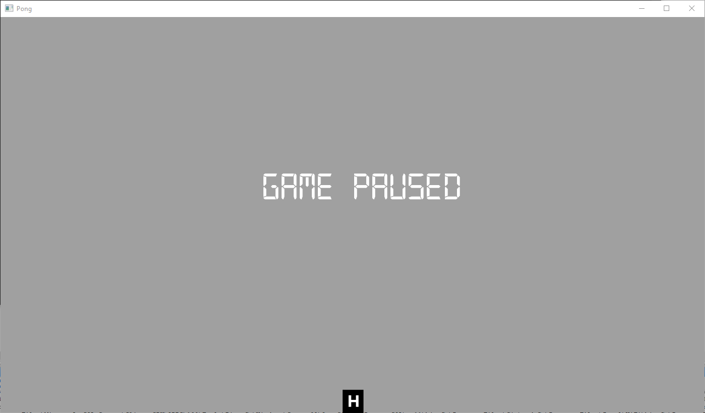

Codul poate fi accesat [aici](https://github.com/mcmarius/prog-calc/blob/v0.0.3rc1-pong/wip/pong/main.c). Urmează să împart codul în mai multe funcții înainte de a mai face modificări. Totuși, în acest moment avem un joc Pong complet funcțional (dacă facem abstracție de bug-uri 😄).

Pentru înregistrarea ecranului, am folosit [ScreenToGif](https://www.screentogif.com/). Pentru Linux, am găsit [peek](https://github.com/phw/peek).

-----

`[2021-01-02]` La mulți ani! Am mai reparat un bug și am modificat un pic logica la ciocnirea cu paletele. Momentan nu consider că ajută să împart codul și în alte funcții, deoarece mai mult s-ar complica lucrurile.

-----
